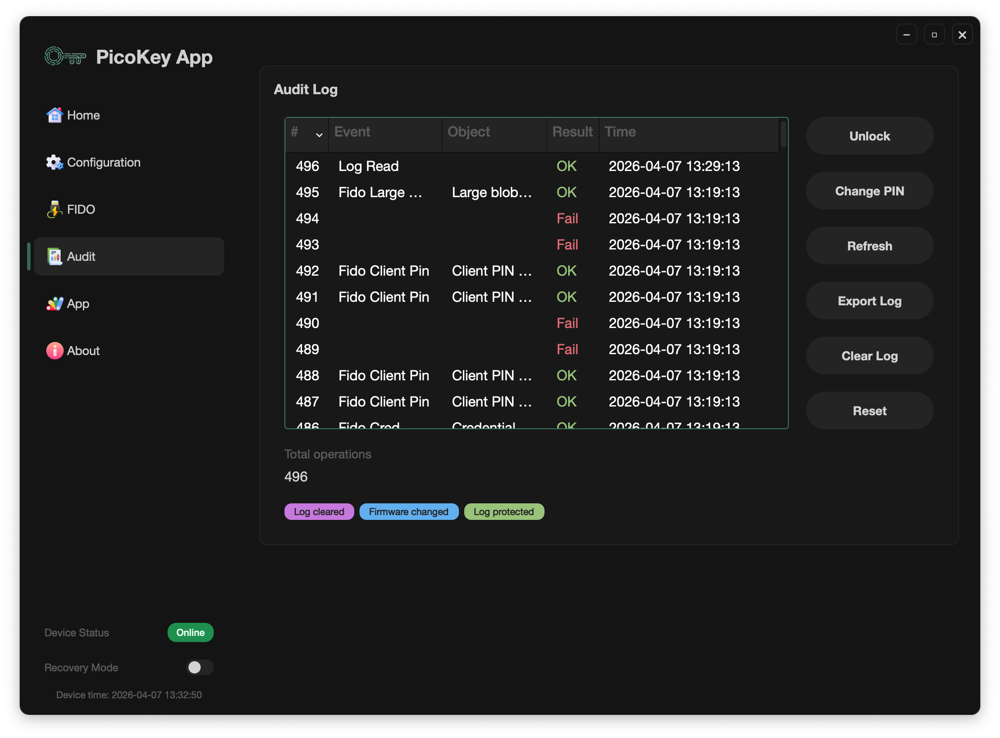

# Audit

The **Audit** section is designed to analyze commands and usage activity on the PicoKey.

Its purpose is to keep operational control of events that occur on the device.

---

## What Audit provides

The Audit Log view shows a chronological list of operations with:

- Operation number (`#`)
- Event name
- Object/target when available
- Result (`OK` / `Fail`)
- Timestamp

It also shows the **Total operations** counter with the accumulated number of recorded events.

---

## Access protection (Audit PIN)

Audit access can be protected with a dedicated PIN (**Audit PIN**).

From this panel you can:

- Unlock protected logs
- Set the Audit PIN (first-time setup)
- Change the Audit PIN (after setup)

---

## Log actions

The panel provides direct log administration actions:

- **Refresh**
- **Export Log**
- **Clear Log**
- **Reset**

---

## Event indicators and status flags

Audit includes status indications to quickly detect relevant situations, such as:

- Log truncated
- Log cleared
- Firmware changed
- PIN/log protection enabled
- Clock not synchronized
- Write errors while storing log entries

In the screenshot example, indicators like **Log cleared**, **Firmware changed**, and **Log protected** are visible.
