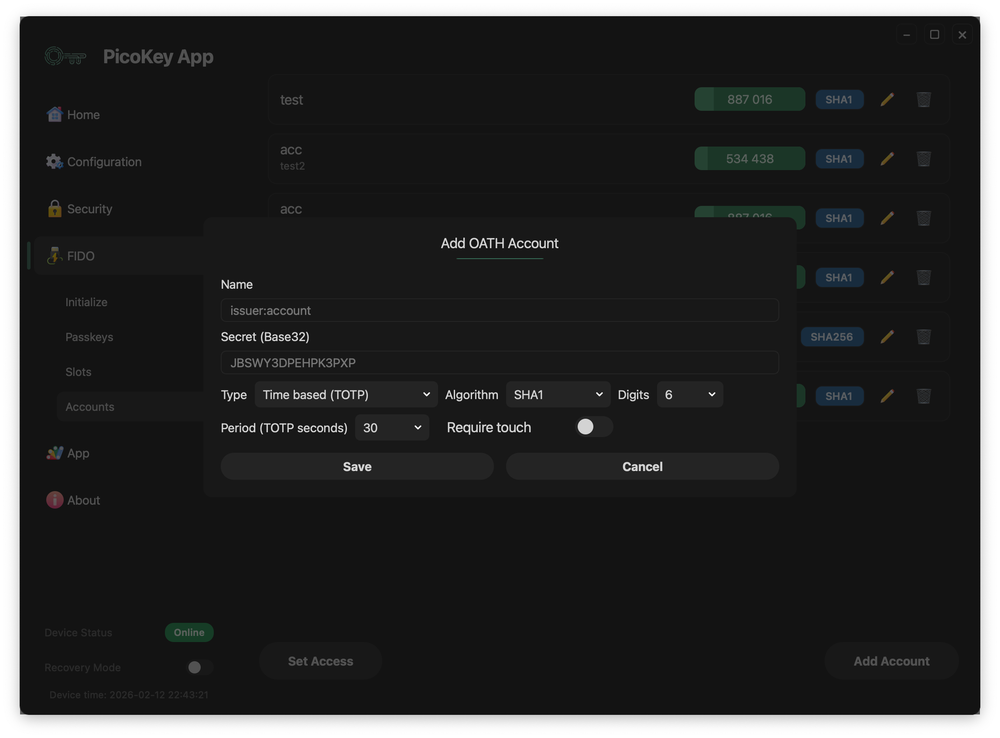
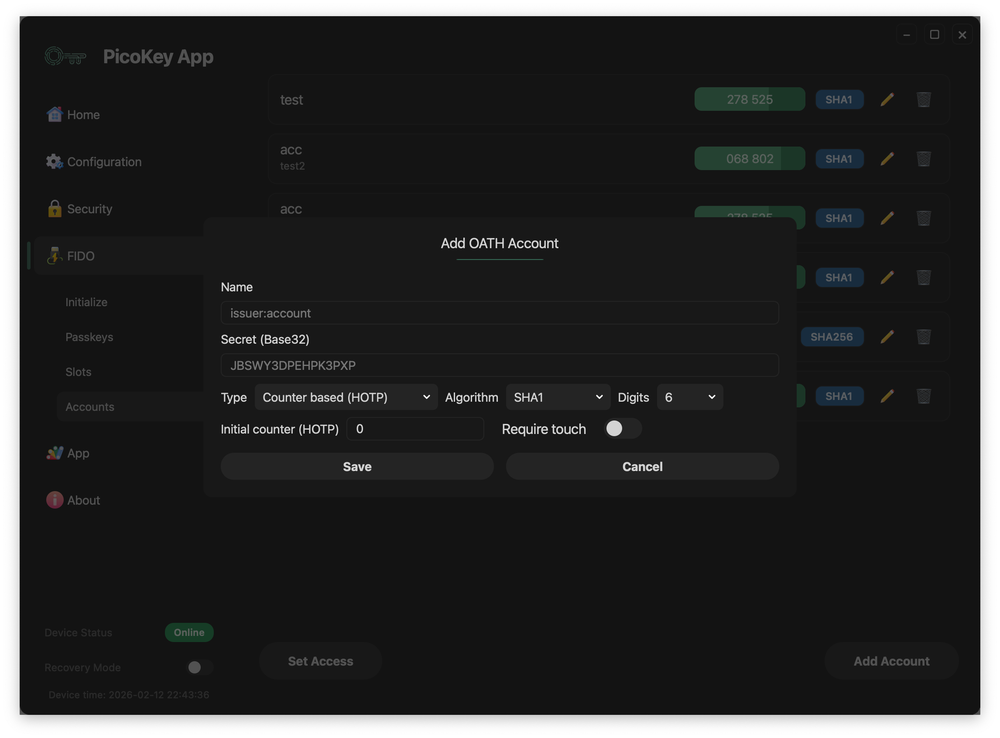
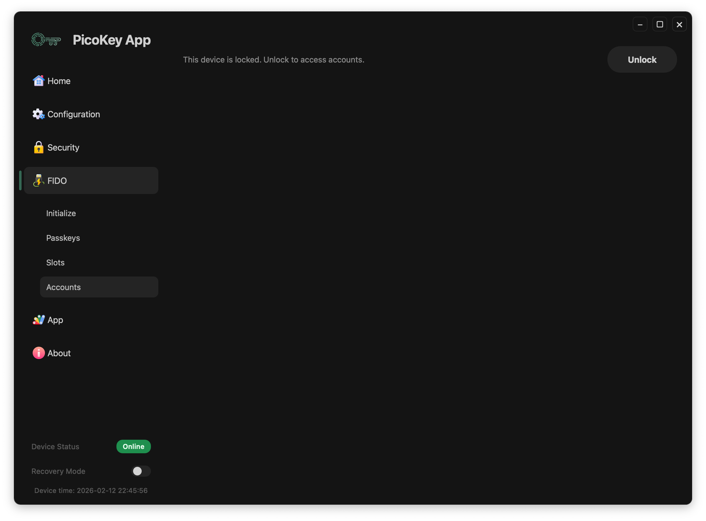

# Accounts

This page describes the **Accounts panel** in PicoKeyApp FIDO management.

---

## Overview

The Accounts panel manages OATH accounts stored on the device.

- List existing accounts
- Add TOTP accounts
- Add HOTP accounts
- Review account status before provisioning

---

## Adding accounts

### Add TOTP

Use the TOTP form to create time-based OTP entries.

#### Fields

- **Issuer**: Service or organization name (for example `GitHub` or `Google`).
- **Account**: Account label shown in the list (usually an email or username).
- **Secret**: Shared OATH secret used to generate codes.
- **Period**: Time step in seconds for code rotation (commonly `30`).
- **Digits**: OTP output length (typically `6` or `8`).

!!! note
    Exact field names can vary slightly depending on firmware and app version.

### Add HOTP

Use the HOTP form to create counter-based OTP entries.

#### Fields

- **Issuer**: Service or organization name.
- **Account**: Account label shown in the list.
- **Secret**: Shared OATH secret used to generate codes.
- **Counter**: Initial counter value used for the first HOTP code.
- **Digits**: OTP output length (typically `6` or `8`).

!!! note
    HOTP codes advance when the counter increases, while TOTP codes rotate based on time.

---

## Locked state

When the OATH applet is protected, account data is hidden until unlock.

