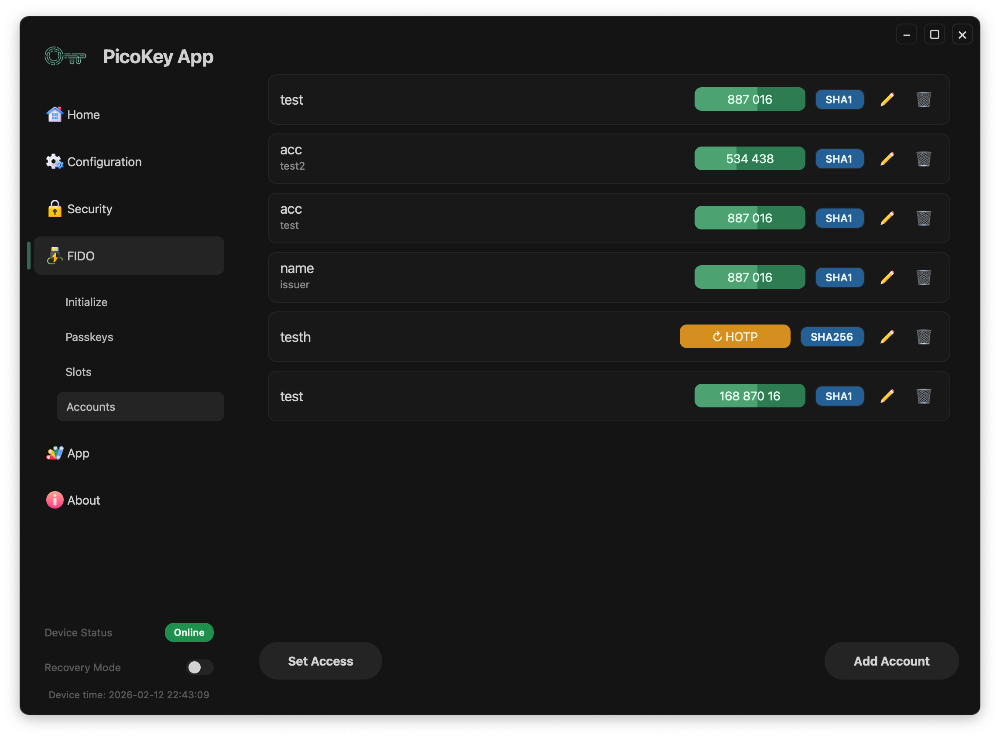
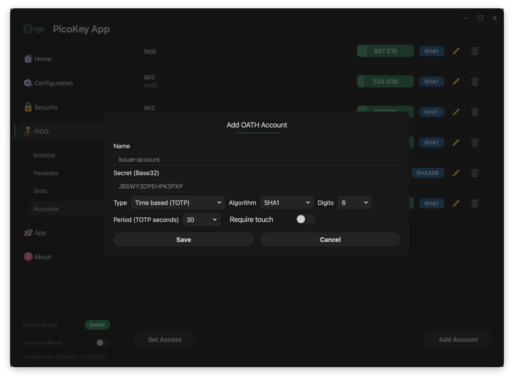
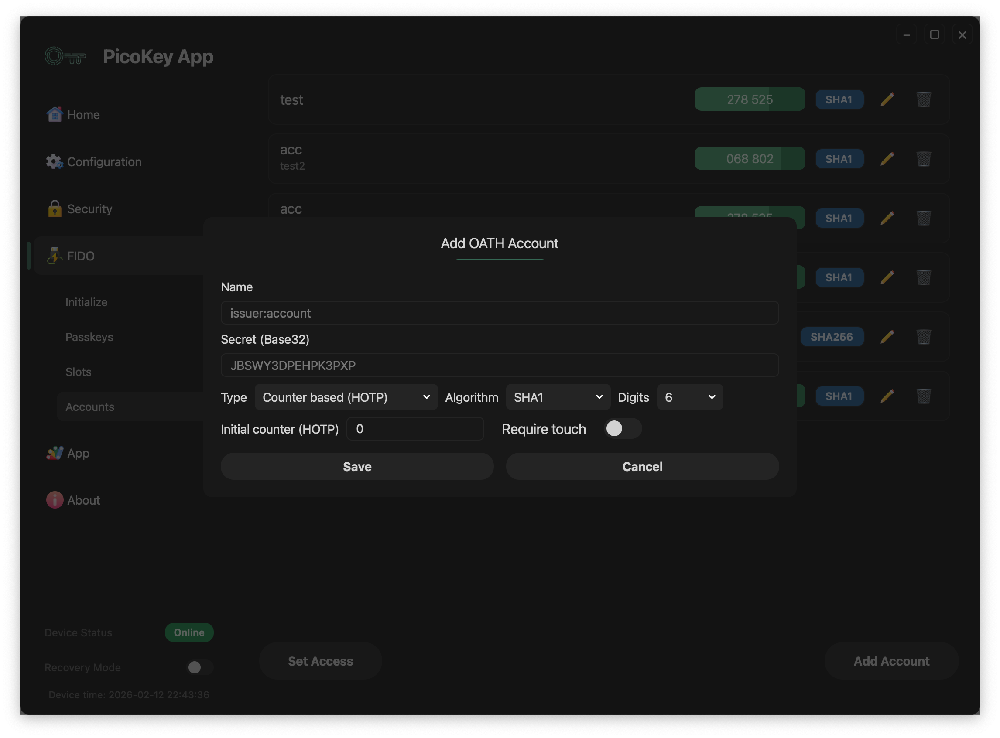
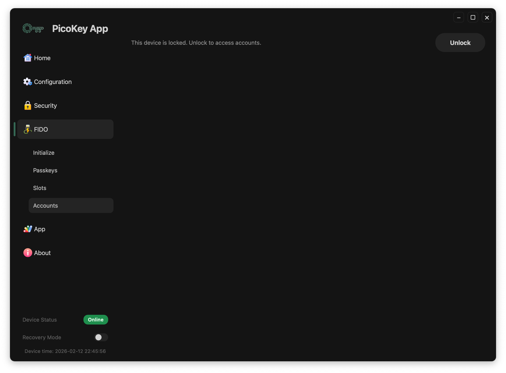

# Accounts

This page describes the **Accounts panel** in PicoKey App FIDO management.

---

## Overview

The Accounts panel manages OATH accounts stored on the device.

- List existing accounts
- Add TOTP accounts
- Add HOTP accounts
- Rename existing accounts
- Delete existing accounts
- Review account status before provisioning

---

## Access control (OATH password)

The OATH applet can be protected with an access password.

Depending on device state, the panel exposes:

- **Set Access**: define an OATH access password
- **Unlock**: unlock the OATH session
- **Change Access**: rotate the OATH access password
- **Clear Access**: remove the OATH access password

When locked, account content is hidden until unlock.

---

## Adding accounts

### Add TOTP

Use the TOTP form to create time-based OTP entries.

#### Fields

- **Name**: account label in the format `issuer:account`.
- **Secret**: Shared OATH secret used to generate codes.
- **Type**: `Time based (TOTP)`.
- **Algorithm**: hash algorithm (`SHA1`, `SHA256`, `SHA512`).
- **Period**: Time step in seconds for code rotation (commonly `30`).
- **Digits**: OTP output length (typically `6` or `8`).
- **Require touch**: requires user touch/presence for code use.

!!! note
    Exact field names can vary slightly depending on firmware and app version.

### Add HOTP

Use the HOTP form to create counter-based OTP entries.

#### Fields

- **Name**: account label in the format `issuer:account`.
- **Secret**: Shared OATH secret used to generate codes.
- **Type**: `Counter based (HOTP)`.
- **Algorithm**: hash algorithm (`SHA1`, `SHA256`, `SHA512`).
- **Counter**: Initial counter value used for the first HOTP code.
- **Digits**: OTP output length (typically `6` or `8`).
- **Require touch**: requires user touch/presence for code use.

!!! note
    HOTP codes advance when the counter increases, while TOTP codes rotate based on time.

---

## Account operations

For each account, management actions include:

- **Rename**
- **Delete**

For OTP usage:

- TOTP entries are refreshed automatically with the period timer.
- Clicking a TOTP/HOTP code chip copies the current code to clipboard.
- For HOTP, clicking the chip also triggers a new counter-based calculation.

---

## Locked state

When the OATH applet is protected, account data is hidden until unlock.

---

## Registration requirement

This panel requires a registered board in PicoKey App. If the board is not registered, account management actions are restricted.
