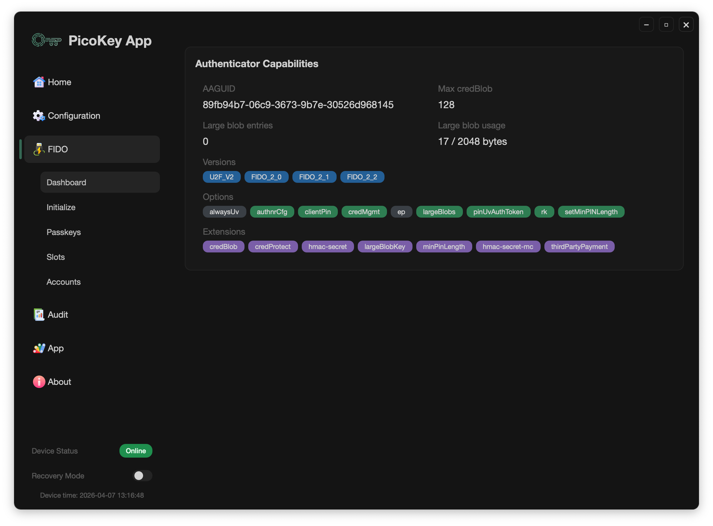

# FIDO Dashboard

This page describes the **FIDO dashboard** in PicoKey App.

---

## Overview

The dashboard is the main entry point for FIDO features and provides direct access to:

- Passkeys management
- OTP slots management
- OATH accounts management
- Initialization and provisioning actions

Use this screen to decide which FIDO area you want to manage for the connected device.

---

## Device information shown

The dashboard exposes key FIDO device metadata, including:

- **AAGUID**
- Maximum **credBlob** size
- Number of **largeBlobs** entries
- **largeBlob** storage usage

These values help evaluate authenticator capabilities and current storage state.

---

## Options and extensions

The dashboard also lists:

- Pico FIDO options reported by the authenticator
- Supported FIDO/WebAuthn extensions

Options shown in **green** are currently active on the connected device.

---

## Notes

- Available actions can vary depending on firmware capabilities.
- Some actions require PIN verification before sensitive data is shown.
