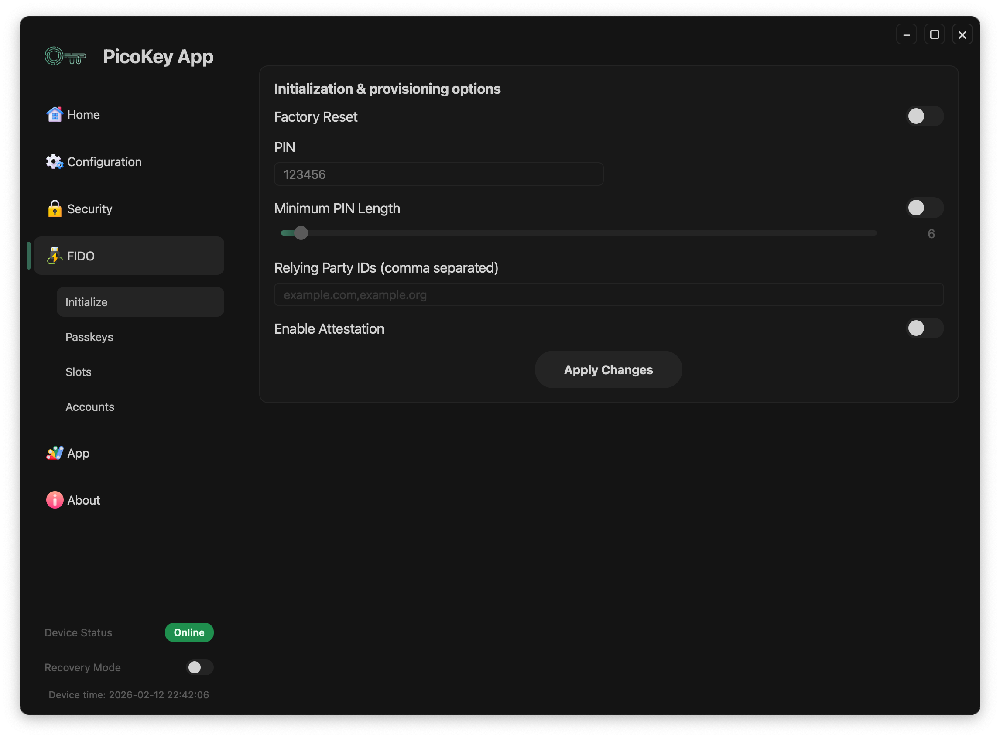

# Pico FIDO Initialization

This page describes the **security initialization and provisioning options** available when using **Pico FIDO** with PicoKey App.

These options are **applied once during initialization** and directly affect the security model of the authenticator.

---

## Initialization options

### PIN

Sets the **user verification PIN** for the authenticator.

- The PIN is required for user verification when enabled
- It protects resident credentials and sensitive operations

!!! warning
    Losing the PIN may permanently lock access to credentials.

---

### Attestation

Enables authenticator attestation.

When enabled:

- The authenticator presents an attestation certificate
- Relying parties can identify the device type

!!! note
    Attestation may reduce user privacy depending on the relying party.

---

### Minimum PIN length

Defines the minimum allowed PIN length.

- Enforced at PIN setup time
- Applies to all future PIN changes

!!! tip
    Longer PINs significantly improve resistance against guessing attacks.

---

### RP IDs restriction

Limits the set of allowed Relying Party IDs.

- RP IDs must be explicitly listed
- Multiple RP IDs are separated by commas

!!! danger
    Incorrect RP ID configuration may prevent authentication on valid services.

---

## Initialization process

After configuring the desired options:

- Click **Initialize**
- The device is provisioned with the selected security parameters

!!! warning
    Initialization is irreversible without a full device reset.

---

## Summary

Security initialization defines the **trust model** of Pico FIDO.

Careful selection of these options ensures:

- Strong authentication guarantees
- Resistance against firmware tampering
- Controlled use of attestation and PIN policies
