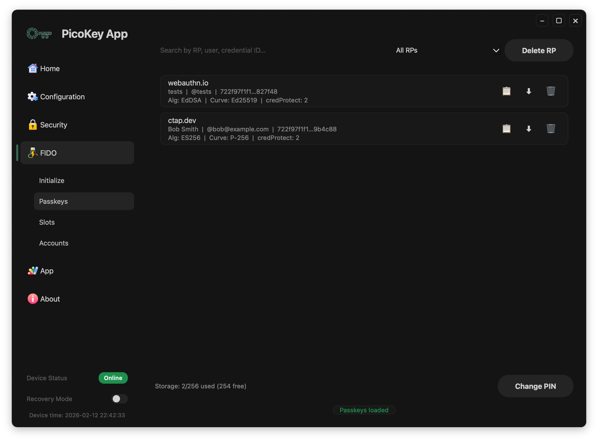
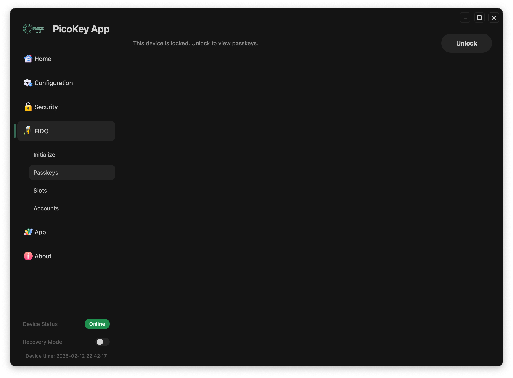

# Passkeys

This page describes the **Passkeys panel** in PicoKeyApp FIDO management.

---

## Overview

The Passkeys panel lists resident FIDO credentials stored on the device and their metadata.

- Credential source and relying party information
- Username / user handle when available
- Management actions supported by firmware

---

## Locked state

When credentials are protected by PIN or policy, the panel requires user verification before showing sensitive data.

!!! note
    Exact fields and actions depend on the installed firmware.

