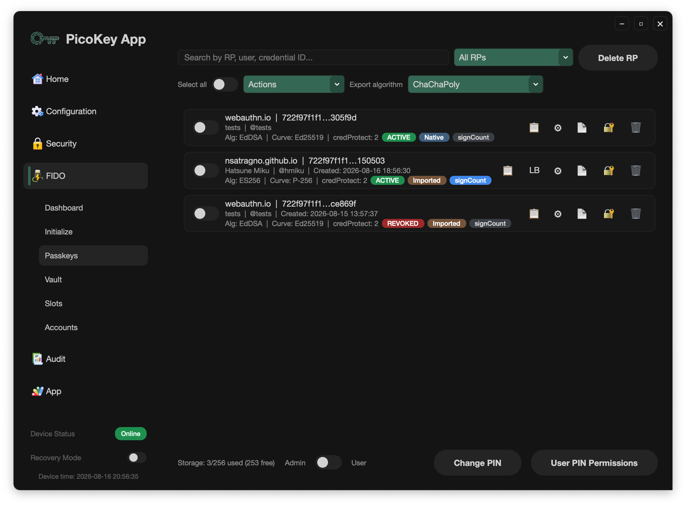
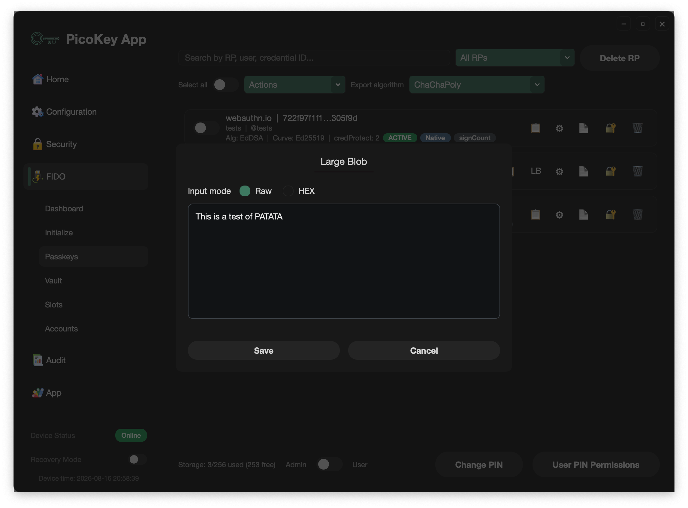
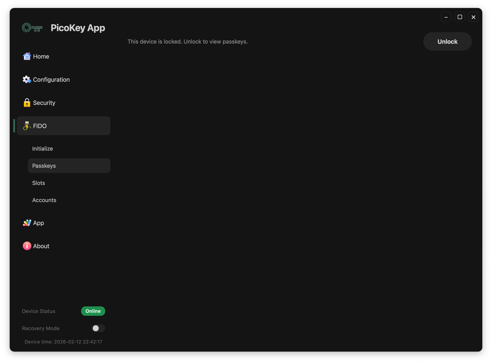

# Passkeys

This page describes the **Passkeys panel** in PicoKey App FIDO management.

---

## Overview

The Passkeys panel lists resident FIDO credentials stored on the device and their metadata.

- Credential source and relying party information
- Username / user handle when available
- Per-credential management actions

---

## Per-credential actions

Each credential row has these actions:

- **Copy Credential ID**
- **Large Blob**: manage the credential’s Large Blob when it has one
- **Credential lifecycle** (gear): set or change an expiration date, or revoke
  the credential
- **Download Credential Metadata** (`JSON` or `CSV`)
- **Export Credential**: export the credential to Vault when an enrolled Vault
  is available
- **Delete Credential**

Credential metadata downloads contain administrative fields such as the RP,
user information, and credential ID. They are separate from **Export
Credential**, which creates an opaque Vault package. Revoked credentials
cannot be changed.

---

## Credential details shown

The Passkeys list includes additional metadata to help administration and troubleshooting:

- Algorithm
- Curve
- `credProtect` extension value, when present
- Credential status (`ACTIVE`, `EXPIRED`, or `REVOKED`)
- Credential source (`Native` or `Imported`)
- Whether `signCount` is enabled or disabled
- Creation date when the device RTC was available when the credential was created
- Expiration date when one has been configured

---

## Selection and bulk operations

The panel supports filtering credentials by common fields, including:

- RP (Relying Party)
- User
- Credential ID
- Other searchable credential fields shown in the table

Each credential row has a selection switch. Use **Select all** to select the
currently displayed credentials, then choose one of these actions from the
bulk-action menu:

- **Export selected**: exports the selected credentials to Vault using the
  chosen export algorithm.
- **Revoke selected**: revokes the selected credentials so they cannot be used
  for assertions again.
- **Delete selected**: deletes the selected resident credentials from the
  board.

Each row also has its own Vault export button, so bulk selection is optional.
Administrative operations also include deleting all credentials for a specific
RP.

## Vault export

When the board is enrolled and the passkey session is unlocked, the panel can
export selected resident credentials to the [Pico Vault](vault.md). Choose the
encryption profile before exporting:

- `ChaChaPoly`
- `AES-GCM`
- `ChaChaPoly + AES-GCM`
- `AES-GCM + ChaChaPoly`

The Vault export stores an opaque package and credential display metadata in
the local Vault store. It does not export the private key as plaintext. A
credential already exported to the active Vault is skipped.

---

## Locked state

When credentials are protected by PIN or policy, the panel requires user verification before showing sensitive data.

!!! note
    Exact fields and actions depend on the installed firmware.
