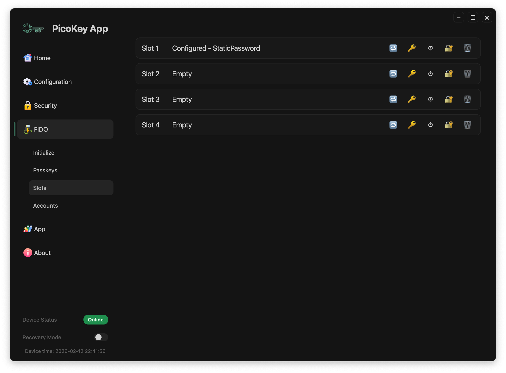

# Slots

This section describes the **slot management view** in PicoKeyApp.

Slots are used to configure and manage **OTP, static password, and related features** supported by the device firmware.

---

## Overview

The Slots view shows all available slots supported by the device.

Each slot can be in one of the following states:

- Empty
- Configured with a specific function

Slots are independent from each other and can be configured individually.

---

## Slot activation

Each slot is activated by pressing the **BOOTSEL** button **N consecutive times**, where `N` is the slot number.

- Slot 1: press once
- Slot 2: press twice in a row
- Slot 3: press three times in a row
- And so on for higher slot numbers

!!! note
    Presses must be consecutive so the device can map the sequence to the correct slot.

For slots configured as **Static Password**, **YubiOTP**, or **HOTP**, activation makes the device type the generated secret/code on the host as if it were a USB keyboard.

!!! note
    This keyboard-style output does not apply to **Challenge-Response** slots.

---

## Slot states

### Empty

An empty slot:

- Does not contain any configuration
- Is available for new provisioning
- Does not perform any action when triggered

---

### Configured

A configured slot shows:

- The slot number
- The configuration type
- Additional information depending on the configuration

Examples of configured slots include:

- Static password
- YubicoOTP

!!! note
    The exact slot capabilities depend on the firmware running on the device.

---

## Slot actions

Each slot exposes a set of actions through icons:

- [Challenge-response](slots/chalresp.md)
- [Static password](slots/static-password.md)
- [HOTP](slots/hotp.md)
- [YubiOTP](slots/yubiotp.md)
- Delete slot configuration

### Delete slot configuration

Deletes the slot configuration.

- Returns the slot to the empty state
- Removes all associated data

!!! danger
    Deleting a slot configuration permanently erases all data stored in the slot.
