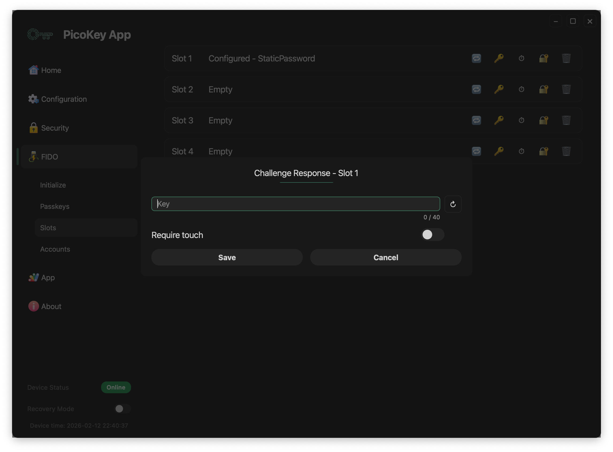

# Slot: Challenge-Response

This page describes the **Challenge-Response slot type** available in PicoKeyApp.

This slot implements a **host-driven challenge–response mechanism**, where the host generates a challenge, the device signs it, and the host verifies the response.

---

## Overview

The Challenge-Response slot is designed to:

- Bind authentication to a secret stored on the device
- Require host-side verification
- Avoid storing reusable secrets on the host

The authentication flow is driven by the host application.

---

## Authentication model

The Challenge-Response mechanism works as follows:

- The host generates a random challenge
- The challenge is sent to the device
- The device signs or processes the challenge using the slot secret
- The response is returned to the host
- The host verifies the response
- Authentication succeeds only if the response matches the expected value

!!! note
    The device does not decide whether authentication succeeds.
    Validation is entirely performed by the host.

---

## Slot configuration

### Key

Defines the **secret key** used for challenge processing.

- The key is stored securely on the device
- The key length is limited by the slot implementation
- Once configured, the key cannot be retrieved in plaintext

!!! warning
    Losing the key means the challenge-response authentication cannot be validated anymore.

---

### Require touch

When enabled:

- User presence is required to generate a response
- The device waits for a physical touch or confirmation

!!! note
    Requiring touch prevents unattended or automated authentication attempts.

---

## Save and cancel

- **Save** stores the slot configuration permanently
- **Cancel** discards all changes

!!! danger
    Saving overwrites any existing slot configuration.

---

## Security properties

The Challenge-Response slot provides:

- Protection against replay attacks (if challenges are random)
- No static secrets sent over the interface
- Optional user presence enforcement

!!! warning
    Security depends entirely on correct challenge generation and verification on the host side.

---

## Typical use cases

Common uses for Challenge-Response slots include:

- Device-bound authentication for custom applications
- Licensing or entitlement checks
- Secure device identification
- Anti-cloning mechanisms

!!! tip
    Always use cryptographically strong random challenges.

---

## Limitations

- No built-in verification on the device
- No standardized protocol (application-specific)
- Host implementation is required

!!! note
    This slot is intended for advanced users and custom integrations.

