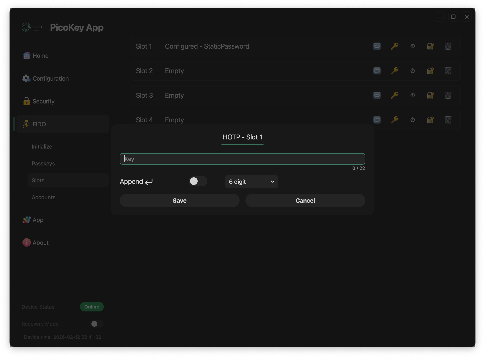

# Slot: HOTP

This page describes the **HOTP (HMAC-Based One-Time Password) slot type** available in PicoKeyApp.

The HOTP slot generates a numeric one-time password derived from a shared secret and emits it as **keyboard input** when triggered.

---

## Overview

The HOTP slot allows the device to:

- Store a shared secret securely
- Generate a one-time password (HOTP)
- Emit the generated code as keystrokes
- Behave as a USB keyboard when activated

The generated code follows the HOTP model and is intended to be verified by a remote system that shares the same secret.

---

## Activation mechanism

The HOTP slot is activated through the **OTP / button interface**.

Activation works as follows:

- The user presses the BOOTSEL button **N times**
- `N` corresponds to the slot number
- The device generates a new HOTP value
- The HOTP code is typed on the host system as keyboard input

!!! note
    No dedicated software is required on the host beyond USB HID keyboard support.

---

## Slot configuration

### Key

Defines the shared secret used to generate HOTP values.

- The key is stored securely on the device
- The key cannot be retrieved once stored
- The maximum key length is limited by the slot implementation

!!! warning
    If the secret is lost, the HOTP sequence cannot be regenerated or validated.

---

### Number of digits

Defines the length of the generated HOTP code.

Supported values:

- 6 digits
- 8 digits

!!! note
    The verifier must be configured to expect the same number of digits.

---

### Append Enter

When enabled:

- An Enter key is sent after the HOTP code
- Useful for automatic form submission

!!! tip
    Enable this option when authenticating into login forms or terminals.

---

## Save and cancel

- **Save** stores the HOTP configuration permanently
- **Cancel** discards the configuration

!!! danger
    Saving overwrites any existing slot configuration.

---

## Security considerations

The HOTP slot:

- Generates a new code on each activation
- Does not expose the shared secret
- Emits the code only as keyboard input

!!! warning
    HOTP counters must remain synchronized with the verification system.

---

## Typical use cases

Common use cases include:

- Two-factor authentication systems
- Legacy systems without TOTP support
- Offline authentication scenarios
- Environments requiring keyboard-based OTP input

!!! tip
    Ensure proper counter resynchronization policies on the server side.

---

## Limitations

- Counter-based (no time component)
- Requires host-side verification
- Susceptible to desynchronization
- Keyboard-based emission only

!!! note
    For time-based OTP, consider using TOTP-capable solutions if available.
