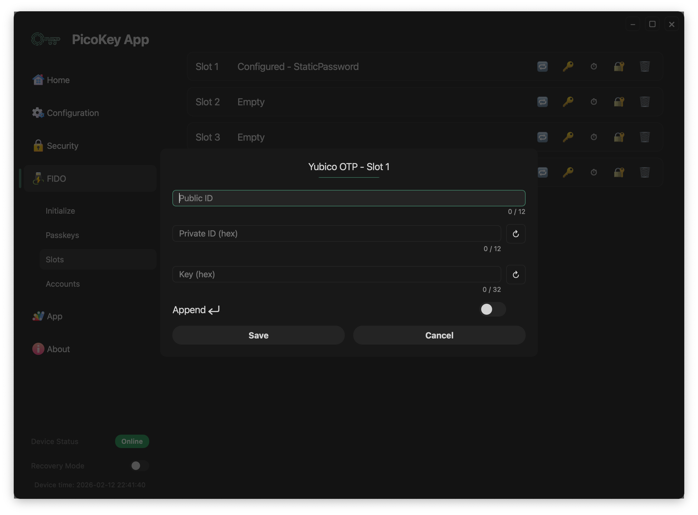

# Slot: Yubico OTP

This page describes the **Yubico OTP slot type** available in PicoKeyApp.

The Yubico OTP slot generates one-time passwords following the **Yubico OTP specification** and emits them as **keyboard input** when triggered.

---

## Overview

The Yubico OTP slot allows the device to:

- Store Yubico-compatible identifiers and secret keys
- Generate Yubico OTP values
- Emit the OTP as keystrokes
- Behave as a USB keyboard when activated

The generated OTPs are compatible with systems expecting standard Yubico OTP authentication.

---

## Activation mechanism

The Yubico OTP slot is activated through the **OTP / button interface**.

Activation works as follows:

- The user presses the BOOTSEL button **N times**
- `N` corresponds to the slot number
- The device generates a Yubico OTP
- The OTP is typed on the host system as keyboard input

!!! note
    No additional software is required on the host beyond USB HID keyboard support.

---

## Slot configuration

### Public ID

Defines the **public identifier** for the Yubico OTP.

- Sent in clear as part of the OTP
- Used by the verification service to identify the device
- Limited in length by the Yubico specification

---

### Private ID (hex)

Defines the **private identifier**.

- Stored securely on the device
- Used internally during OTP generation
- Must be provided in hexadecimal format

!!! warning
    The private ID cannot be retrieved once stored.

---

### Key (hex)

Defines the **secret key** used to generate the Yubico OTP.

- Stored securely on the device
- Must be provided in hexadecimal format
- Never exposed outside the device

!!! danger
    Losing the secret key prevents OTP verification and cannot be recovered.

---

### Append Enter

When enabled:

- An Enter key is sent after the OTP
- Useful for automatic form submission

!!! tip
    Enable this option when authenticating on web login forms.

---

## Save and cancel

- **Save** stores the Yubico OTP configuration permanently
- **Cancel** discards the configuration

!!! danger
    Saving overwrites any existing slot configuration.

---

## Security considerations

The Yubico OTP slot:

- Follows Yubico OTP specifications
- Does not expose secrets over software interfaces
- Emits OTPs only as keyboard input

!!! warning
    Anyone with physical access to the device may trigger OTP generation.

---

## Typical use cases

Common use cases include:

- Authentication against Yubico-compatible servers
- Legacy systems using Yubico OTP
- Environments requiring keyboard-based OTP input

!!! tip
    Ensure the verification backend is correctly configured with matching identifiers and keys.

---

## Limitations

- Requires a compatible Yubico OTP verification service
- Keyboard-based emission only
- No host-side confirmation from the device

!!! note
    This slot is intended for compatibility with existing Yubico OTP infrastructures.

