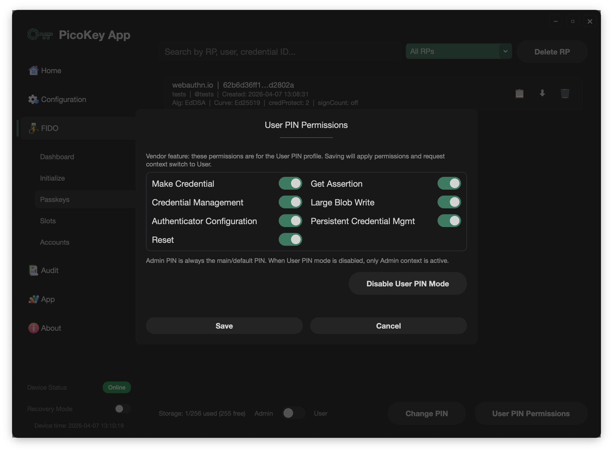

# User PIN (Vendor Feature)

This page describes the PicoKey vendor feature that adds a second FIDO PIN context with separate permissions.

## Purpose

This feature is designed for **multi-user FIDO Passkeys** scenarios.

It allows an Admin to decide which operations are allowed for a User context and which are not.

Typical use case: an organization configures the key with a manager/admin account first, then hands the key to a worker account with reduced administration permissions.

---

## What this feature adds

This is **not** a standard FIDO behavior. It is a vendor extension implemented by PicoKey firmware and PicoKey App.

The device can operate with two PIN contexts:

- **Admin PIN**: full management permissions.
- **User PIN**: restricted permissions defined by the Admin.

Each context has its **own PIN value**.

---

## Permission model

When `User PIN` is enabled, Admin can define what User is allowed to do in Passkeys management.

The following permissions can be enabled or disabled for User context:

- Create credentials
- Credential management
- Authentication
- Large Blob write
- Configure authenticator
- Persistent credential management
- Reset authenticator

Default behavior:

- All permissions are enabled by default.
- **Authentication is always enabled** and cannot be effectively removed, otherwise the user would not be able to authenticate to any service.

Admin context keeps full access regardless of User restrictions.

---

## Default context behavior

- If `User PIN` is **disabled**: only Admin context is active.
- If `User PIN` is **enabled**: device defaults to **User context** after each connect/reconnect.

This means opening PicoKey App with an enabled User PIN starts in User context unless you explicitly switch.

---

## Context switching in PicoKey App

Context selection is done in **FIDO > Passkeys** using the context switch.

Precondition:

- A PIN must already be configured for the active context. If PIN is not set up, context switch is not available.

Operational sequence:

1. Connect device (loads User context by default when enabled).
2. Unlock first (context switch requires an unlocked state).
3. Switch context to Admin when elevated actions are required.
4. If needed, unlock with the PIN of the selected context to continue protected operations.

If you need to disable User PIN, switch to Admin context first, then disable User PIN.

---

## Practical notes

- Treat Admin and User PIN as separate credentials.
- Define User permissions with least privilege.
- If management actions are unavailable, verify current context before troubleshooting.
