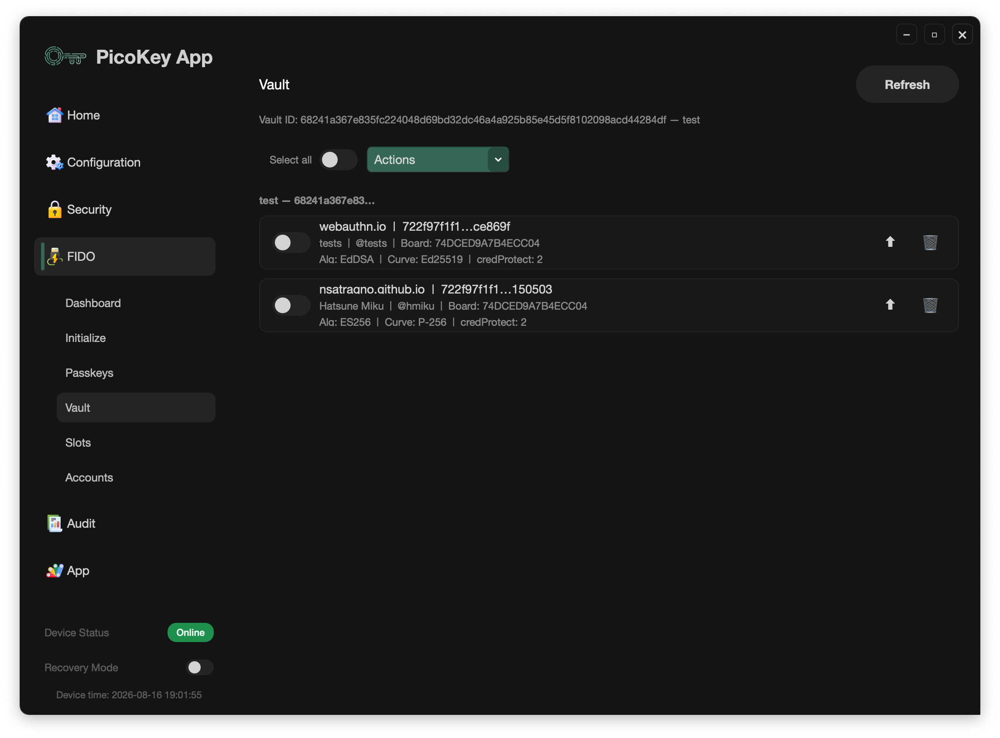

# FIDO Vault

The **FIDO > Vault** panel manages local backups of credentials exported from
an enrolled Pico FIDO device. It is the desktop part of the [Pico Vault
workflow](../../picofido/vault.md); it does not enroll a board.

## Before opening the panel

1. Register the board in PicoKey App.
2. Install and run the standalone `pico-vault-enroller`.
3. Enroll the board with an encrypted enrollment envelope.
4. Unlock **FIDO > Passkeys** with the device PIN.

Select **FIDO > Vault** and click **Refresh**. The panel shows the Vault ID
when the board is enrolled. If it is not enrolled, the panel points to the
standalone enroller.

The local store may contain packages from multiple Vault IDs. The panel groups
them by Vault ID and shows the active board's Vault ID at the top.

## Export a passkey

From **FIDO > Passkeys**, choose one or more resident credentials and select an
export profile:

- `ChaChaPoly`
- `AES-GCM`
- `ChaChaPoly + AES-GCM`
- `AES-GCM + ChaChaPoly`

Use the credential's Vault export action or **Export selected**. The app saves
the opaque Vault package and display metadata in its local Vault store. A
credential already stored in the active Vault is not exported again.

The local store can display the relying party, user information, algorithm,
board serial, and Vault ID. It does not turn the package into a plaintext
private key.

## Import a passkey

On the destination board:

1. Enroll it with the same enrollment envelope.
2. Unlock **FIDO > Passkeys**.
3. Open **FIDO > Vault** and click **Refresh**.
4. Select a credential and use its import button, or choose **Import selected**.

Only packages whose Vault ID matches the active board can be imported. A
package from another Vault remains visible in its group but its import action
is disabled. Imported credentials are shown in the destination's passkey list
as separate resident credentials.

The same encrypted enrollment envelope can be used to enroll multiple boards.
Those boards report the same Vault ID and can exchange exported credentials
through the same Vault domain. Create a new envelope only when a separate Vault
domain is intended.

Use **Select all** and **Import selected** for a bulk import from the active
Vault group. The panel also provides an import button for each eligible row.

## Delete local Vault records

The row delete button and **Delete selected** remove packages from the local
Vault store. They do not delete a credential already imported into a board.
Deleting the local package is therefore a backup-store operation, not a
device credential-management operation.

## Security and recovery

Keep the enrollment JSON, its passphrase, device PIN, and exported packages
under separate protection. The App cannot reset a lost enrollment passphrase.
If a package or enrollment secret is exposed, treat it as a recovery incident
and rotate the Vault domain according to the [Vault operations
guide](https://github.com/polhenarejos/pico-vault-enroller/blob/main/docs/operations.md).
