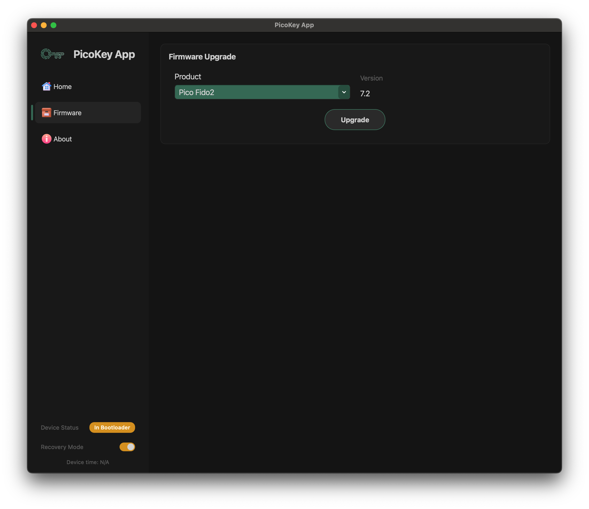

# Firmware update

This section explains how to update the firmware of a PicoKeys device using **PicoKeyApp**.

Firmware updates modify the software running on the device and may affect available features and behavior.

---

## Overview

Firmware updates are used to:

- Install a new firmware variant (e.g. Pico HSM, Pico FIDO, Pico OpenPGP)
- Update an existing firmware to a newer version
- Recover a device in case of a corrupted or incomplete firmware

Firmware updates are **explicit user actions** and are never performed automatically.

---

## Supported update modes

Depending on the device state and firmware, PicoKeyApp may support firmware updates when the device is in:

- **BOOTSEL / RESCUE mode** (recommended and most reliable)
- Normal operation mode (firmware-dependent)

For new or freshly flashed devices, **RESCUE mode is expected**.

---

## Before you start

Before performing a firmware update:

- Ensure the device is connected directly to the computer
- Avoid USB hubs during the update
- Close other applications that might access the device
- Do not disconnect the device during the process

!!! Warning
    Interrupting a firmware update may leave the device in a recovery state
    and require manual intervention.

---

## Entering BOOTSEL / RESCUE mode

If the device is not already in BOOTSEL / RESCUE mode:

1. Go to **Home**
2. Click **Reboot to BOOTSEL**
3. Wait for the device to reconnect

Once in BOOTSEL / RESCUE mode, PicoKeyApp should detect the device again.

---

## Performing a firmware update

The typical firmware update process is:

1. Open the firmware update section in PicoKeyApp
2. Select the firmware file to be installed
   (firmware files are usually provided as a binary image)
3. Start the update process
4. Wait until PicoKeyApp reports completion
5. Reconnect the device if requested

During the update:

- Progress information may be displayed
- The device may temporarily disconnect and reconnect

---

## After the update

After a successful firmware update:

- The device may reboot automatically
- The reported firmware version should change accordingly
- Available features in PicoKeyApp may change depending on the firmware

It is recommended to:

- Return to **Home**
- Verify firmware version and device status
- Perform commissioning if required by the new firmware

---

## Firmware update and configuration

Installing a new firmware may:

- Reset some configuration settings
- Require re-commissioning
- Change available configuration or security options

!!! Note
    Firmware functionality is defined by the installed firmware,
    not by PicoKeyApp itself.

---

## If something goes wrong

If the firmware update fails:

- Do not unplug the device immediately
- Follow any instructions shown by PicoKeyApp
- If the device enters BOOTSEL / RESCUE mode, retry the update

If recovery is not possible or behavior is unclear, open a ticket at:

[https://github.com/polhenarejos/picokeyapp/issues](https://github.com/polhenarejos/picokeyapp/issues)

Include:

- PicoKeyApp version
- Firmware version (if known)
- Device platform and board model
- A description of what happened and at which step

---

## Important notes

- Firmware updates are explicit and user-controlled
- PicoKeyApp does not automatically select or install firmware
- Always verify that you are installing the correct firmware variant for your device
