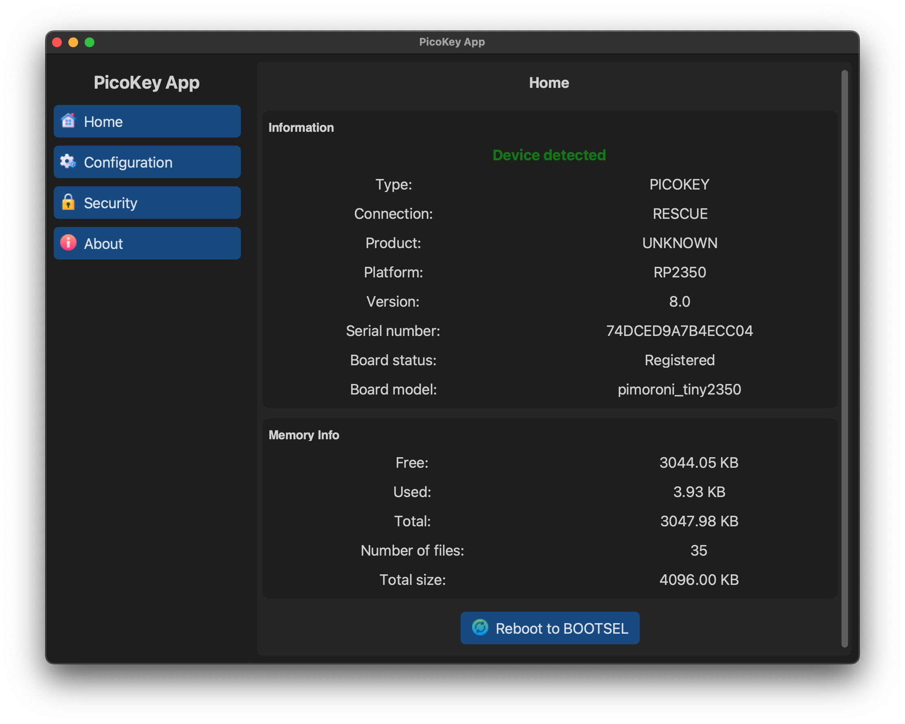

# Home

The **Home** section provides an overview of the currently connected device.

---

## Device detection

When a device is correctly detected, PicoKeyApp displays the following information:

- **Type** – Device family (e.g. `PICOKEY`)
- **Connection** – Current connection mode (e.g. `RESCUE`)
- **Product** – Firmware-reported product type
- **Platform** – MCU platform (e.g. `RP2350`)
- **Version** – Firmware version
- **Serial number** – Unique device identifier
- **Board status** – Registration state (Registered / Not registered)
- **Board model** – Hardware model identifier

A green *Device detected* indicator confirms that communication with the device is working correctly.

---

## Memory information

The **Memory Info** section shows filesystem usage on the device:

- Free memory
- Used memory
- Total memory
- Number of files
- Total filesystem size

This information is useful to verify available space and to diagnose abnormal storage usage.

---

## Reboot to BOOTSEL

The **Reboot to BOOTSEL** button reboots the device into BOOTSEL (recovery) mode.

!!! warning
    BOOTSEL mode should only be used when required (firmware update or recovery).
    Interrupting critical operations may require manual recovery.
