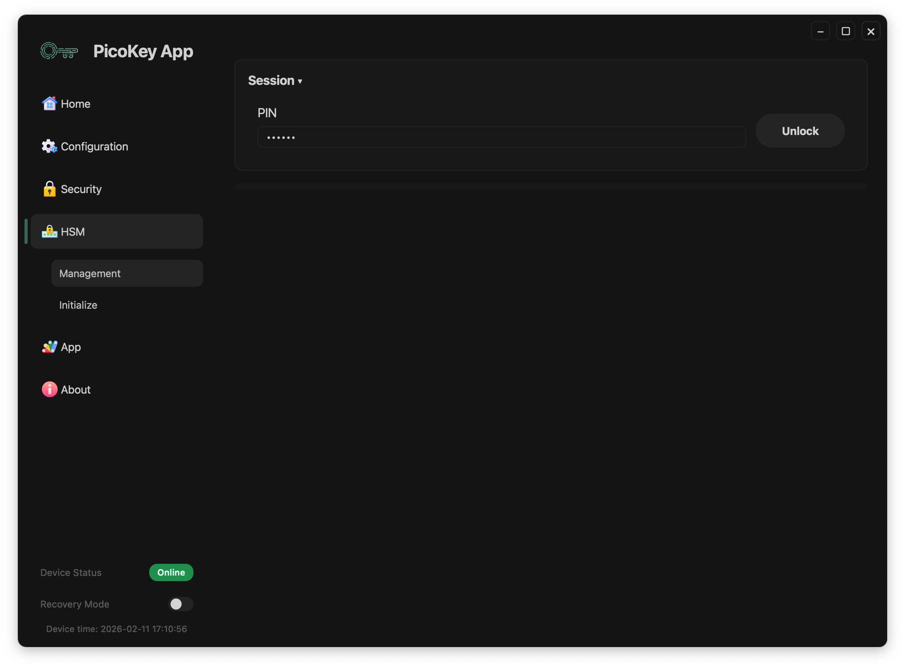
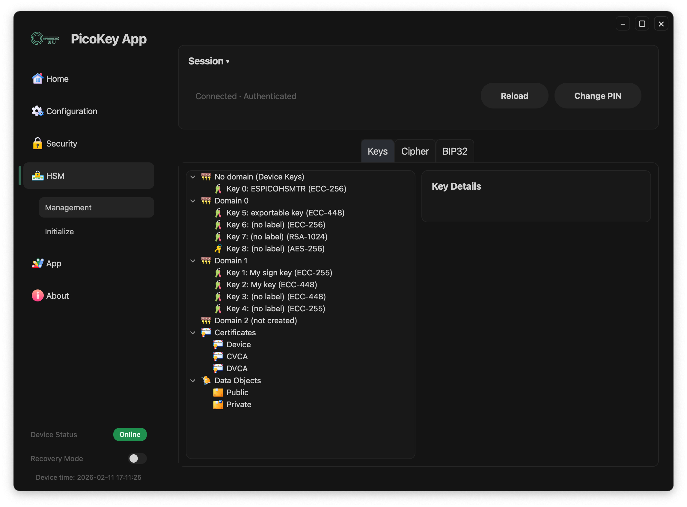
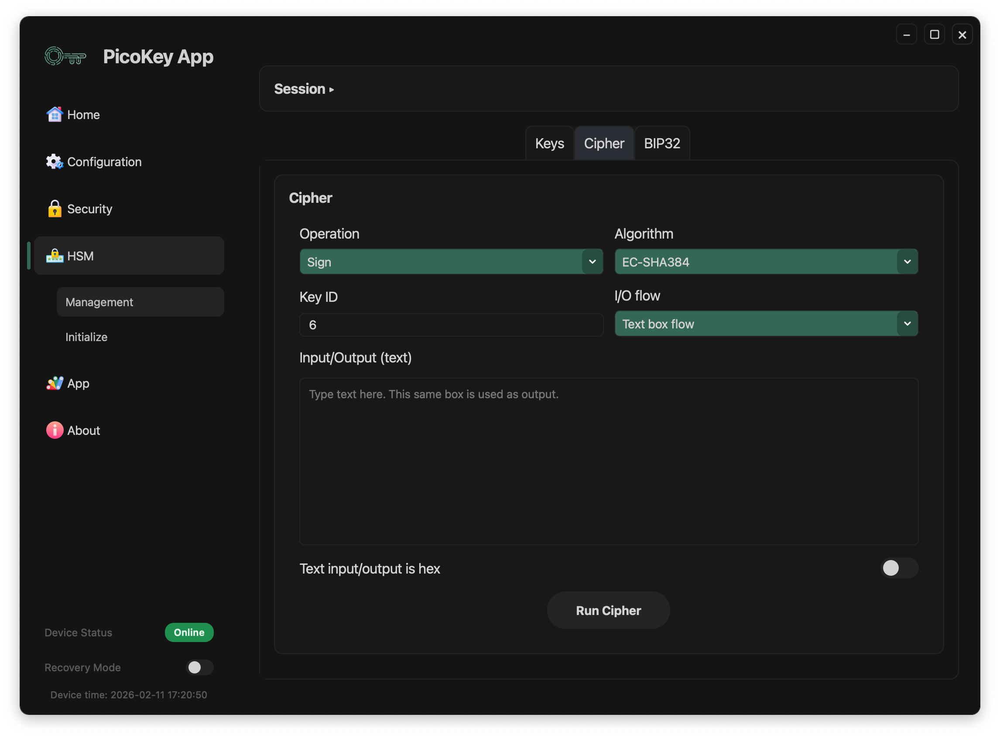
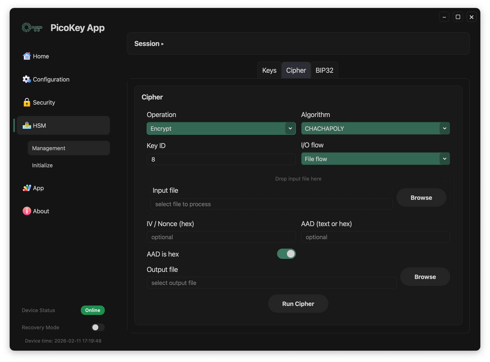
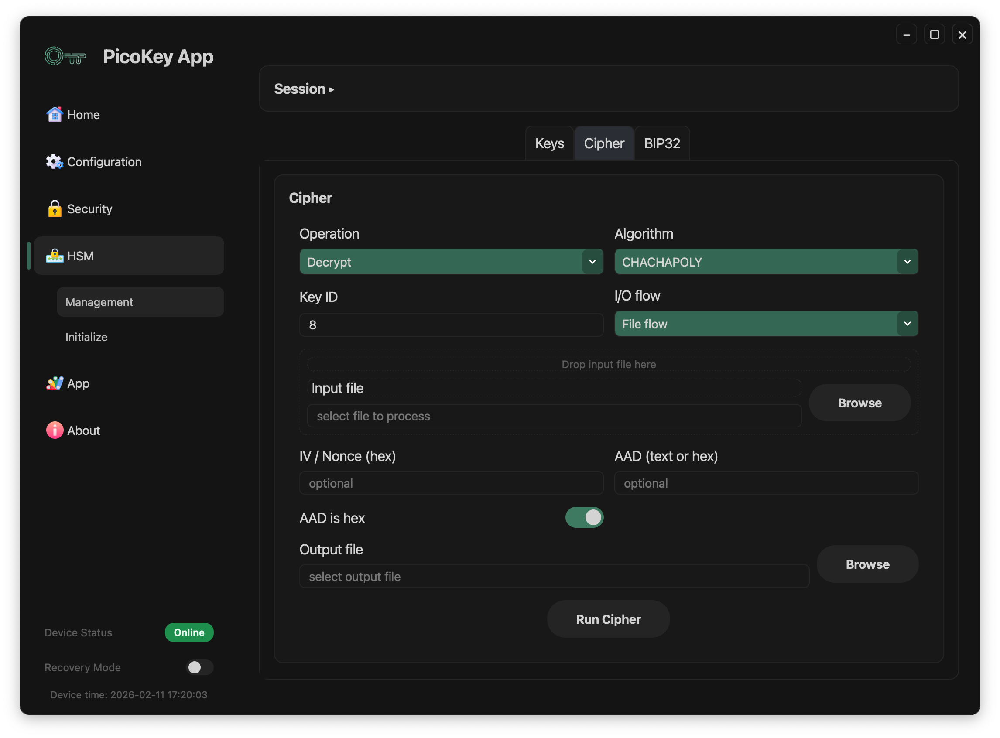
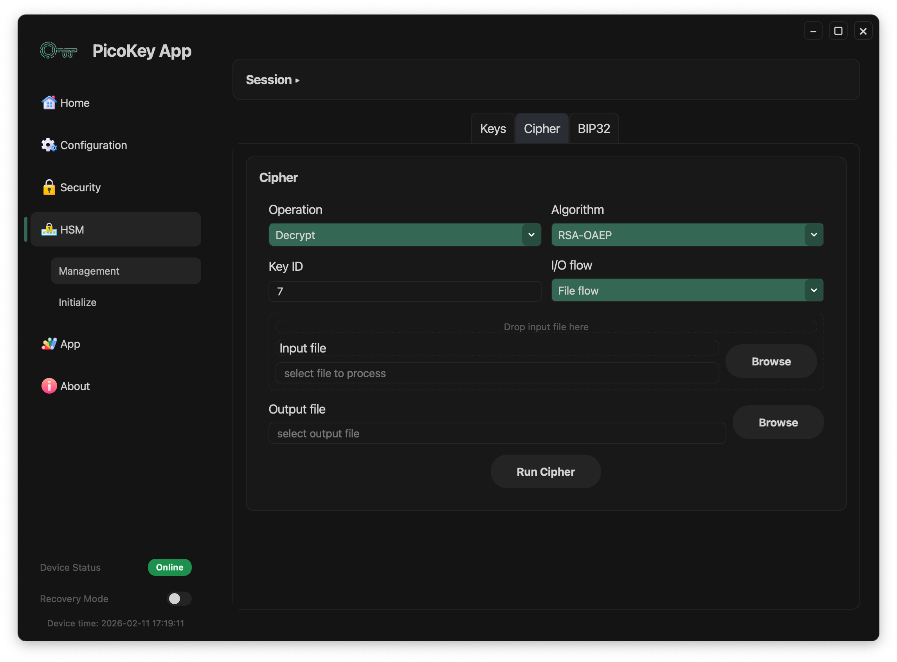
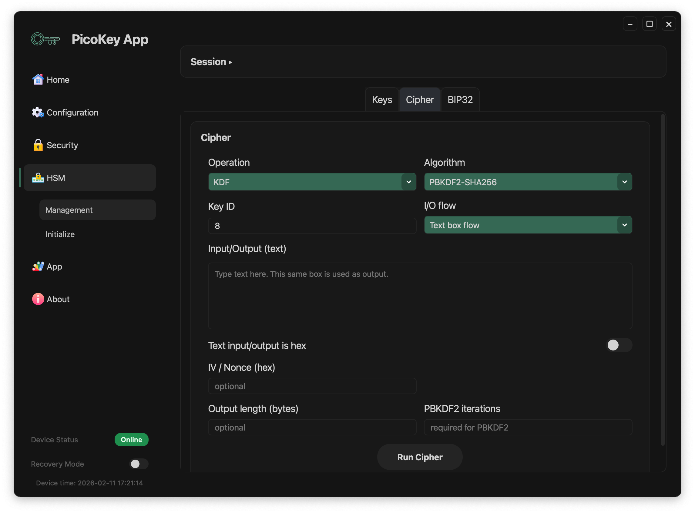

# Pico HSM Cipher

This page documents **HSM > Management > Cipher** in PicoKey App.

The `Cipher` tab executes crypto operations using an existing key (`Key ID`).

---

## Prerequisite

Before running cipher operations:

1. Go to `HSM > Management`.
2. Enter `PIN`.
3. Click **Unlock**.
4. Wait until keys are loaded.
5. If needed, expand `Session` and use **Reload** / **Change PIN**.
6. Use a valid `Key ID`.

---

## Main controls

- **Operation**: `Sign`, `Decrypt`, `Encrypt`, `MAC`, `KDF`
- **Algorithm**: available values depend on key type and selected operation
- **Key ID**: key handle used by the operation
- **I/O flow**: `File flow` or `Text box flow`
- **Run Cipher**: executes the selected operation

---

## I/O flow

Two input/output modes are available.

### File flow

Use files as input and output.

Behavior:

- Input is read from **Input file** (or drop zone)
- Output is written to **Output file**
- **Browse** buttons select input/output paths

### Text box flow

Use a single text area for both input and output.

Behavior:

- You write plaintext/data/signing input in the text box
- After execution, the same box is replaced with the result
- The `Text input/output is hex` toggle switches between plain string mode and hex mode

---

## Operation-specific fields

- `Encrypt`/`Decrypt` with AEAD/stream-like modes can require **IV / Nonce (hex)** and optional **AAD (text or hex)**.
- `MAC` uses file/text input and writes tag output.
- `KDF` can include **Output length (bytes)** and, for PBKDF2, **PBKDF2 iterations**.

---

## Algorithm availability by key type

### EdDSA keys (`ed25519`, `ed448`)

- Only `Sign` is available.
- The only signature algorithm is `EDDSA`.

### Other ECC keys

- `Sign` supports:
- `EC-RAW`
- `EC-SHA1`
- `EC-SHA224`
- `EC-SHA256`
- `EC-SHA384`
- `EC-SHA512`

### RSA keys

- `Sign` supports:
- `RSA-RAW`
- `RSA-PKCS1`
- `RSA-PKCS1-SHA1`
- `RSA-PKCS1-SHA224`
- `RSA-PKCS1-SHA256`
- `RSA-PKCS1-SHA384`
- `RSA-PKCS1-SHA512`
- `RSA-PSS`
- `RSA-PSS-SHA1`
- `RSA-PSS-SHA224`
- `RSA-PSS-SHA256`
- `RSA-PSS-SHA384`
- `RSA-PSS-SHA512`

- `Decrypt` supports:
- `RSA-RAW`
- `RSA-PKCS1`
- `RSA-OAEP`

### AES keys (symmetric keys)

- `Encrypt` / `Decrypt` support:
- `CHACHAPOLY`
- `AES-ECB`
- `AES-CBC` (input length must be a multiple of 16 bytes)
- `AES-OFB`
- `AES-CFB`
- `AES-GCM`
- `AES-CCM`
- `AES-CTR`
- `AES-XTS`

- `MAC` supports:
- `CMAC`
- `HMAC-SHA1`
- `HMAC-SHA224`
- `HMAC-SHA256`
- `HMAC-SHA384`
- `HMAC-SHA512`

- `KDF` supports:
- `HKDF-SHA256`
- `HKDF-SHA384`
- `HKDF-SHA512`
- `PBKDF2-SHA1`
- `PBKDF2-SHA224`
- `PBKDF2-SHA256`
- `PBKDF2-SHA384`
- `PBKDF2-SHA512`
- `X963-SHA1`
- `X963-SHA224`
- `X963-SHA256`
- `X963-SHA384`
- `X963-SHA512`

!!! note
    If a selected key type does not support an operation, the corresponding algorithms are not offered in the selector.
