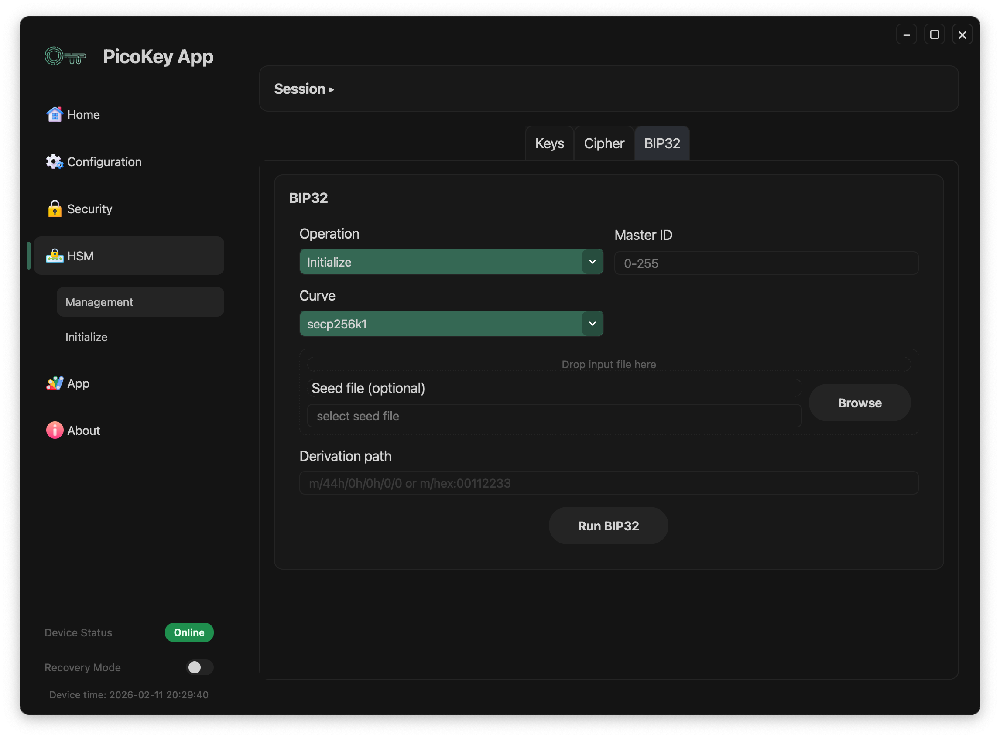
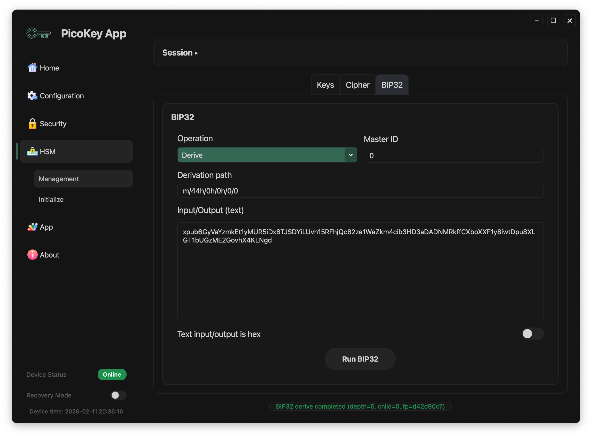
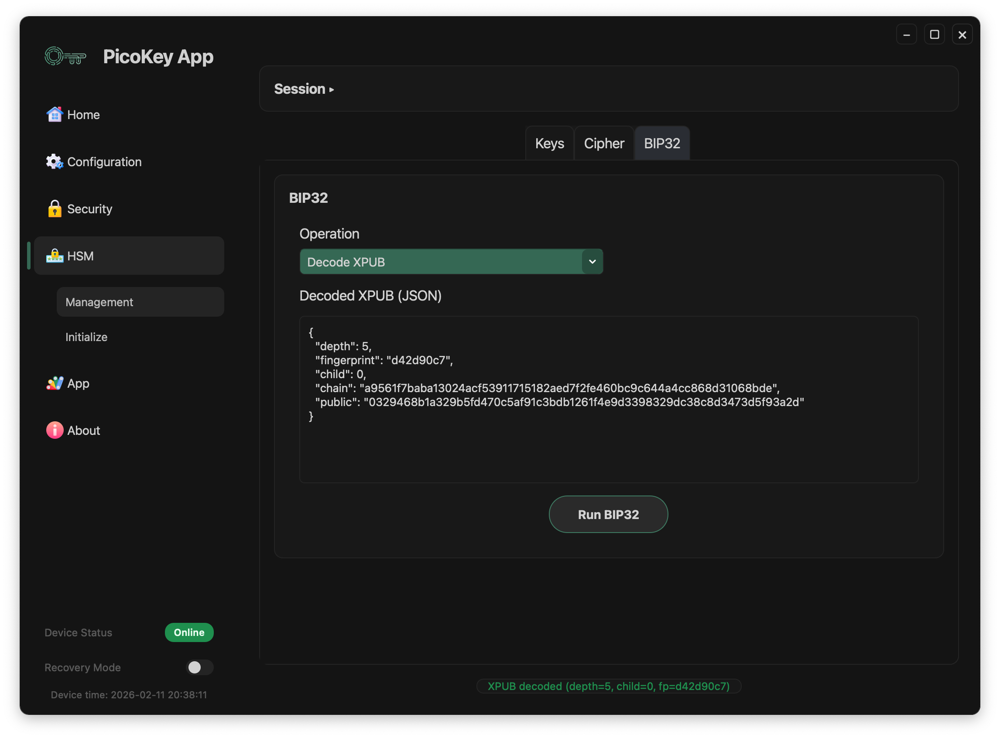
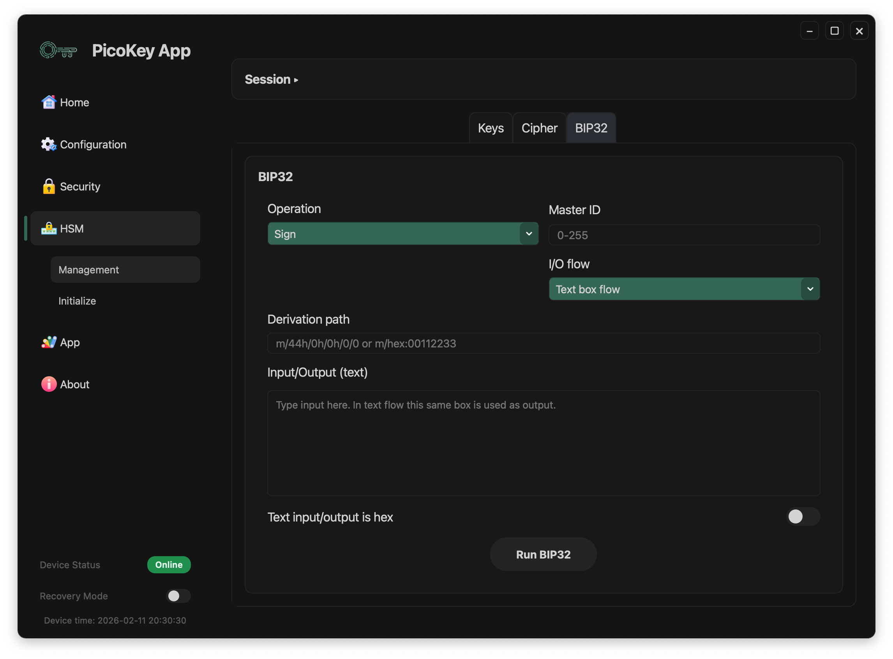
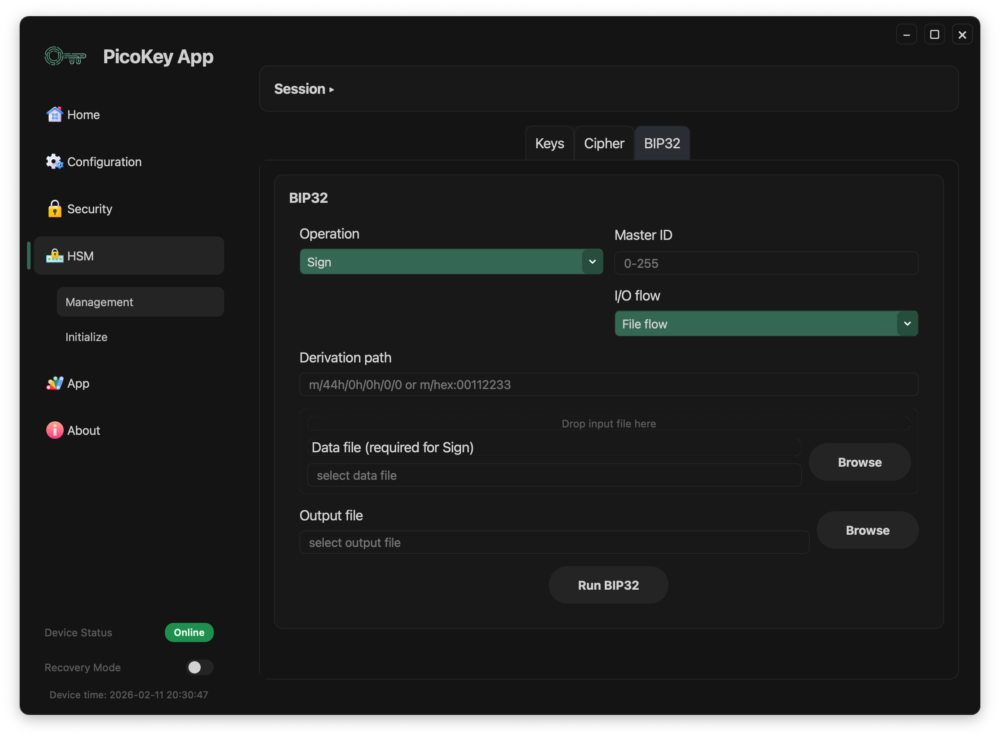

# Pico HSM Hierarchical Derivation (HD / BIP32)

This page documents **HSM > Management > BIP32** in PicoKey App.

The BIP32 tab provides hierarchical deterministic key workflows:

- Initialize master material
- Derive child keys / XPUB data by derivation path
- Decode XPUB
- Sign using a derivation path

---

## Prerequisite

Before running BIP32 operations:

1. Go to `HSM > Management`.
2. Enter `PIN`.
3. Click **Unlock**.
4. Wait until keys are loaded.
5. Use the `BIP32` tab.

---

## Main controls

Common controls in BIP32:

- **Operation**: `Initialize`, `Derive`, `Decode XPUB`, `Sign`
- **Master ID**: identifier that binds a master node to its curve type (`0-255`)
- **Derivation path**: path format such as `m/44h/0h/0h/0/0`
- **Run BIP32**: executes the selected operation

Supported master curve types:

- `secp256k1`
- `secp256r1`
- Symmetric key (`SLIP`)

---

## Initialize

Initializes HD material for the selected master ID.

Visible fields:

- **Curve** (example shown: `secp256k1`)
- **Seed file (optional)**: optional seed input from file
- **Derivation path**

If no seed file is provided, initialization uses internal/random generation according to device behavior.

---

## Derive

Derives BIP32 child output from a derivation path and selected master.

Visible fields:

- **Derivation path**
- **Input/Output (text)**: output is written in the same box
- **Text input/output is hex** toggle

After execution, status feedback appears in the bottom message area (depth/child/fingerprint summary).

---

## Decode XPUB

Decodes an XPUB value to structured JSON metadata.

Visible output:

- `depth`
- `fingerprint`
- `child`
- `chain`
- `public`

The decoded payload is shown in **Decoded XPUB (JSON)**.

---

## Sign with derivation path

BIP32 signing uses the selected master plus derivation path.

Two I/O modes are available, similar to the Cipher tab.

### Sign with text box flow

Behavior:

- Enter data in **Input/Output (text)**
- Output replaces the same text box after execution
- `Text input/output is hex` switches between plain text and hex

### Sign with file flow

Behavior:

- **Data file (required for Sign)**: input file to sign
- **Output file**: destination file for signature/result
- **Browse** buttons select file paths

---

## Notes

- `Master ID` lets you keep multiple independent HD roots and associates each root with its selected curve type.
- A valid derivation path is required for derive/sign operations.
- `BIP32` operations are available only after a successful unlock.
