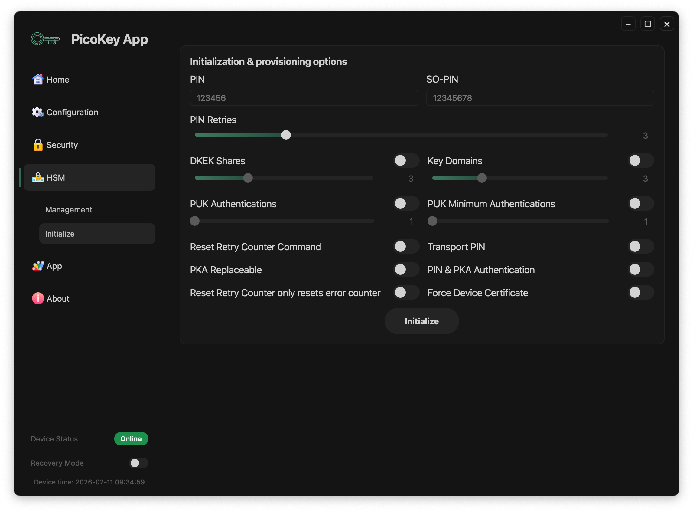

# Pico HSM Initialization

This page documents the **security initialization options** available for **Pico HSM** when using PicoKey App.

These settings control **PIN policies, key protection mechanisms, and recovery options**.

---

## PIN configuration

### User PIN

Defines the primary user PIN.

- Required for cryptographic operations
- Protects private keys and stored objects

!!! tip
    The default PIN is `648219`.

---

### SO PIN

Defines the Security Officer PIN.

- Used for administrative operations
- Required for certain reset and recovery commands

!!! note
    The SO PIN should be stored separately from the user PIN.

---

### PIN retries

Configures the number of allowed incorrect PIN attempts.

- Applies to both user PIN and SO PIN
- Exceeding the limit blocks access

!!! danger
    Exceeding retry limits may permanently lock the device.

---

## Advanced protection options

### DKEK shares

Enables **Distributed Key Encryption Key** (DKEK) shares.

- Splits the encryption key into multiple shares
- Requires a threshold number of shares for recovery

!!! note
    This option is only useful when no key domains are configured. Otherwise, each
    key domain can be configured independently with different DKEK shares.

---

### PUK authentications

Defines the total number of public keys supported for authentication.

- Used when PKA is enabled
- Adds an additional authentication mechanism without PIN

---

### PUK minimum authentications

Defines the number of minimum of public keys for authentication.

- Used when PKA is enabled

---

### Key domains

Enables key domain separation.

- Keys are grouped into isolated domains
- Access policies can differ per domain

---

## Additional options

### Reset retry counter command

Allows resetting the retry counter via command in case PIN is locked. It also
allows PIN resetting.

- Useful for controlled recovery scenarios

!!! danger
    If this option is disabled, Pico HSM will not be recoverable if PIN locked.
    In this case, a Factory Reset will be necessary and all keys and data
    will be lost permanently.

---

### Transport PIN

Allows setting a temporary PIN during transport or provisioning.

!!! warning
    Transport PINs should be changed immediately after deployment.

---

### PKA replaceable

Allows replacement of public key authentication data.

---

### Combined PIN & PKA authentication

Requires both PIN and public key authentication.

- Provides multi-factor protection

---

### Reset Retry Counter only resets error counter

Reset Retry command only resets retry counter, not the PIN.

!!! note
    This option is usable only when Reset Retry Counter command is enabled.

---

### Force Device Certificate

Downloads and resigns the attestation certificate. Do not use unless you experiment
issues with 3rd party apps.

---

## Initialization process

After configuring all parameters:

- Click **Initialize**
- The device is provisioned with the selected security configuration

!!! danger
    Some options cannot be changed without reinitializing the device.
