# Pico HSM Key Management

This page documents **HSM > Management > Keys** in PicoKey App.

It covers:

- Unlocking the HSM session and using the collapsed session panel
- Key domain setup and DKEK workflows
- Key generation/import
- Key, certificate, and data object management

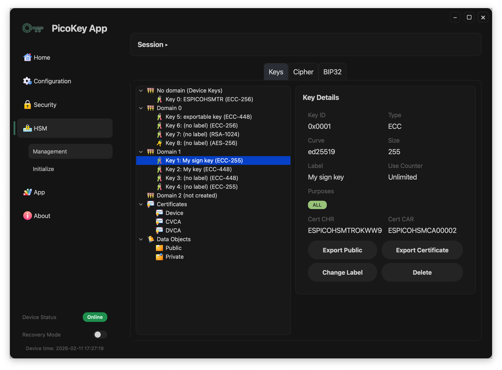

---

## Load management session

When opening `HSM > Management`, the first state is the unlock view.

1. Enter the user `PIN`.
2. Click **Unlock**.
3. Wait until key loading finishes.

After a successful unlock, the `Session` section collapses to save space.

If you expand the `Session` section again, you can access maintenance actions:

### Session buttons

- **Reload**: reloads keys/domains/certificates for the current authenticated session.
- **Change PIN**: opens the PIN change flow.

!!! note
    If unlock fails, management data is not loaded.

---

## Keys view layout

The `Keys` tab has two main areas:

- Left panel: hierarchical tree (`No domain`, `Domain N`, keys, certificates, data objects)
- Right panel: context actions and details for the selected item

Tabs shown at the top:

- **Keys**: key tree and key/domain actions
- **Cipher**: cryptographic operations view
- **BIP32**: hierarchical deterministic key view

For cipher operations, see [Cipher](cipher.md).

---

## Key domains workflow

### 1) Setup a new key domain

Select a domain marked as `(not created)`.

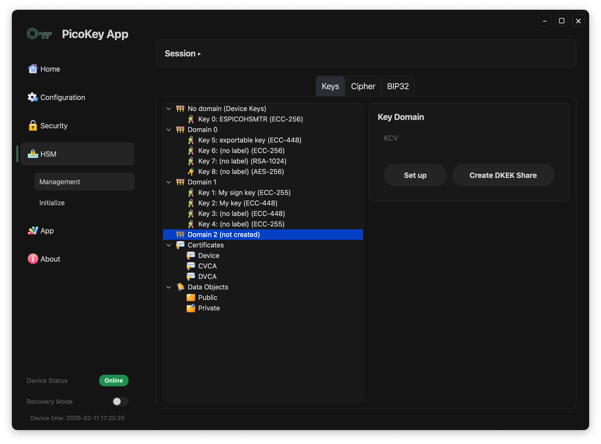

Available actions in this state:

- **Set up**: creates the key domain.
- **Create DKEK Share**: creates a DKEK share file in `.pbe` format so it can be imported later.

### 2) Create DKEK share (`.pbe`)

Click **Create DKEK Share** to open the DKEK share creation dialog.

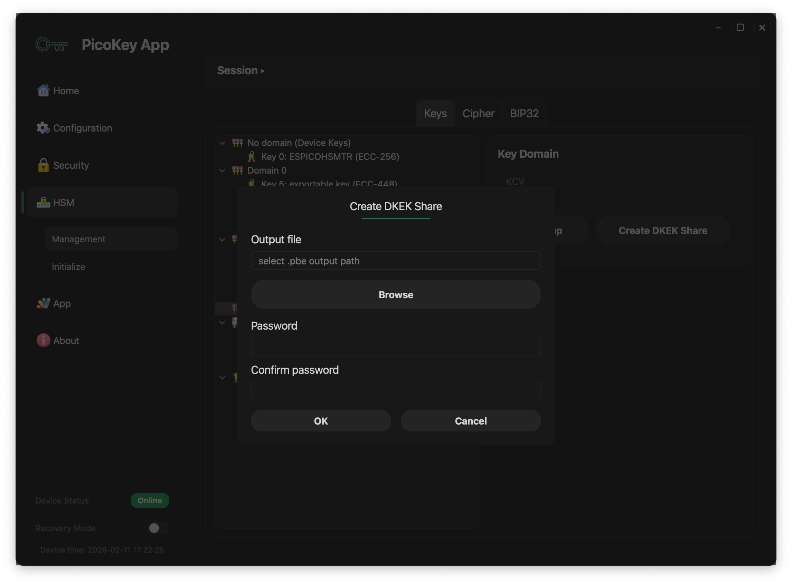

Dialog fields:

- **Output file**: destination path for the generated `.pbe` file.
- **Browse**: opens file picker for output location.
- **Password**: password used to protect the DKEK share.
- **Confirm password**: must match the password.

### 3) Import missing DKEK share(s)

If a domain shows `Missing 1 DKEK`, click **Import DKEK**.

A password dialog is shown:

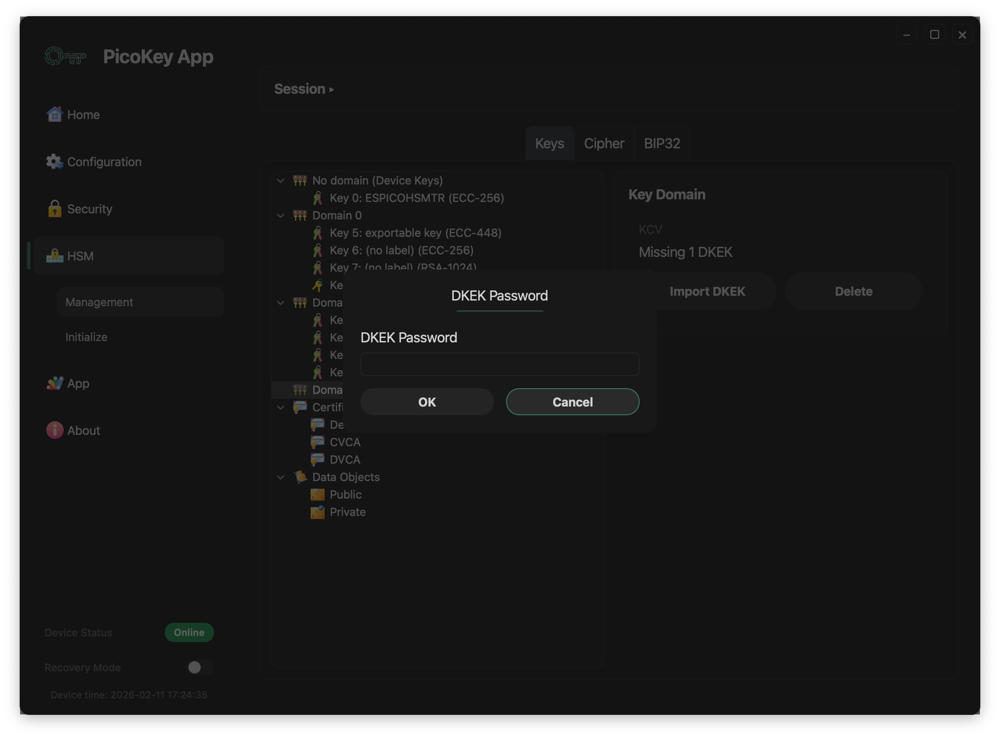

This step loads the DKEK share into the domain using the share password.

### 4) Domain ready state

When the required DKEK material is present, the domain shows a `KCV` and full actions:

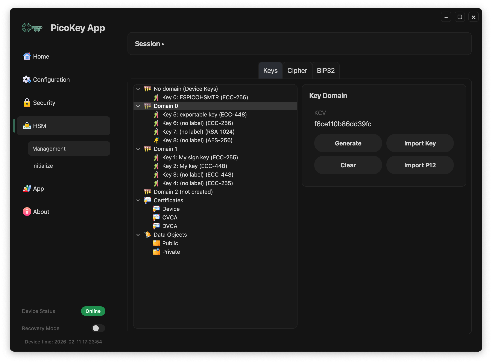

Domain buttons:

- **Generate**: create a new key directly in that domain
- **Import Key**: import an existing key into the selected domain
- **Clear**: remove DKEK material for that domain session/state
- **Import P12**: import key/certificate material from PKCS#12
- **Delete**: remove the domain configuration

!!! danger
    Deleting a domain or clearing critical domain material can make keys unavailable.

---

## Generate key

From a ready domain, click **Generate**.

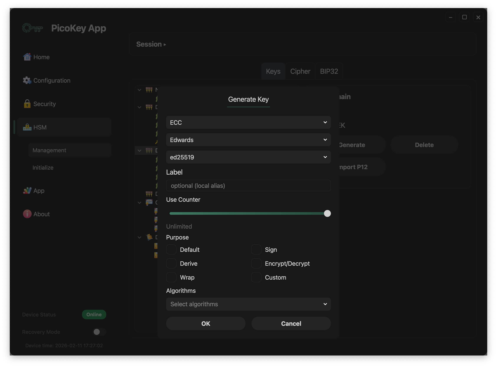

Visible parameters in the dialog:

- Key type/family/curve selectors (example shown: `ECC` + `Edwards` + `ed25519`)
- **Label**: local alias for easier identification
- **Use Counter**: usage limit slider (`Unlimited` when not limited). This is a decrementing counter: each key use decreases it by 1, and when it reaches `0` the key can no longer be used.
- **Purpose** flags: `Default`, `Derive`, `Wrap`, `Sign`, `Encrypt/Decrypt`, `Custom`
- **Algorithms**: algorithm set bound to key usage policy

---

## Import PKCS#12 (P12)

From domain actions, click **Import P12**.

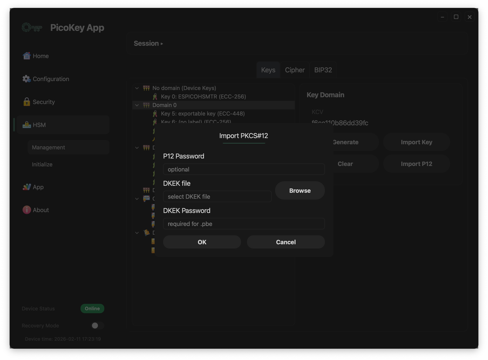

Dialog fields:

- **P12 Password**: optional password for the PKCS#12 container
- **DKEK file** + **Browse**: select DKEK file used during import
- **DKEK Password**: password used for PBE when required

---

## Key details actions

When a key is selected in the tree, the right panel shows metadata and action buttons.

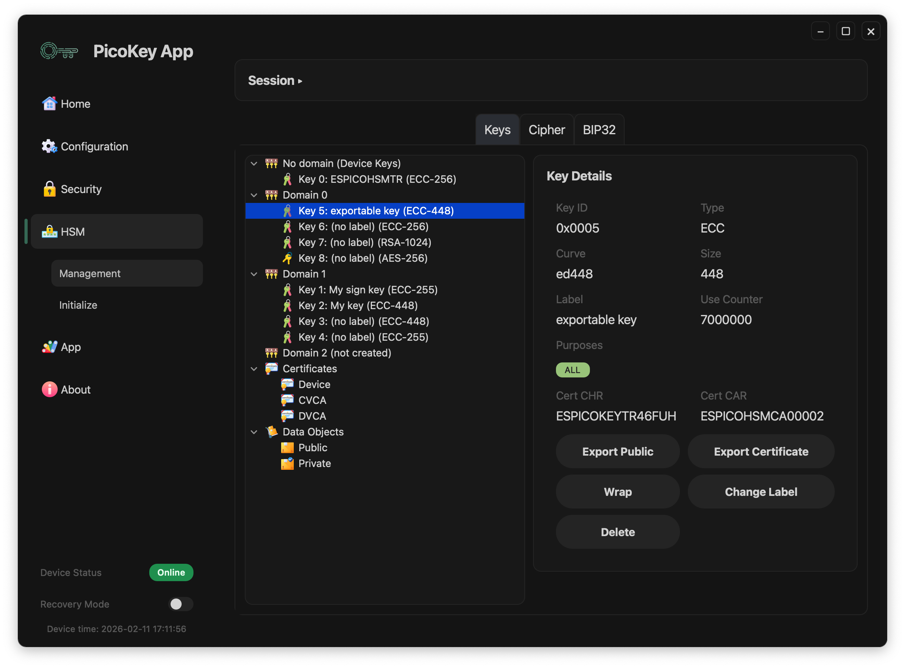

Common key actions:

- **Export Public**: exports the public part of the selected key
- **Export Certificate**: exports associated certificate when available
- **Change Label**: updates key label
- **Delete**: deletes the selected key

Conditional action:

- **Wrap**: wraps (exports in protected form) keys marked as exportable/wrappable

Displayed metadata includes:

- `Key ID`, `Type`, `Curve`, `Size`
- `Label`, `Use Counter`, `Purposes`
- Certificate references (`Cert CHR`, `Cert CAR`) when present

!!! warning
    `Delete` is irreversible. Ensure backups or wrapped exports exist before removal.

---

## Certificate details

When you select an item under `Certificates` (for example `Device`, `CVCA`, `DVCA`), the right panel shows certificate metadata.

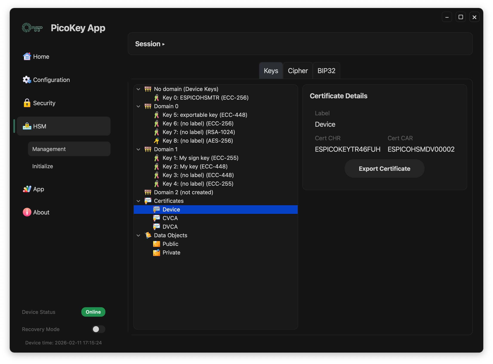

Visible fields:

- `Label`: certificate alias shown in the UI
- `Cert CHR`: certificate holder reference
- `Cert CAR`: certificate authority reference

Action:

- **Export Certificate**: exports the selected certificate file.

!!! note
    This action exports certificate data only, not the private key.

### Certificate import

When the root `Certificates` node is selected, the right panel shows the import action.

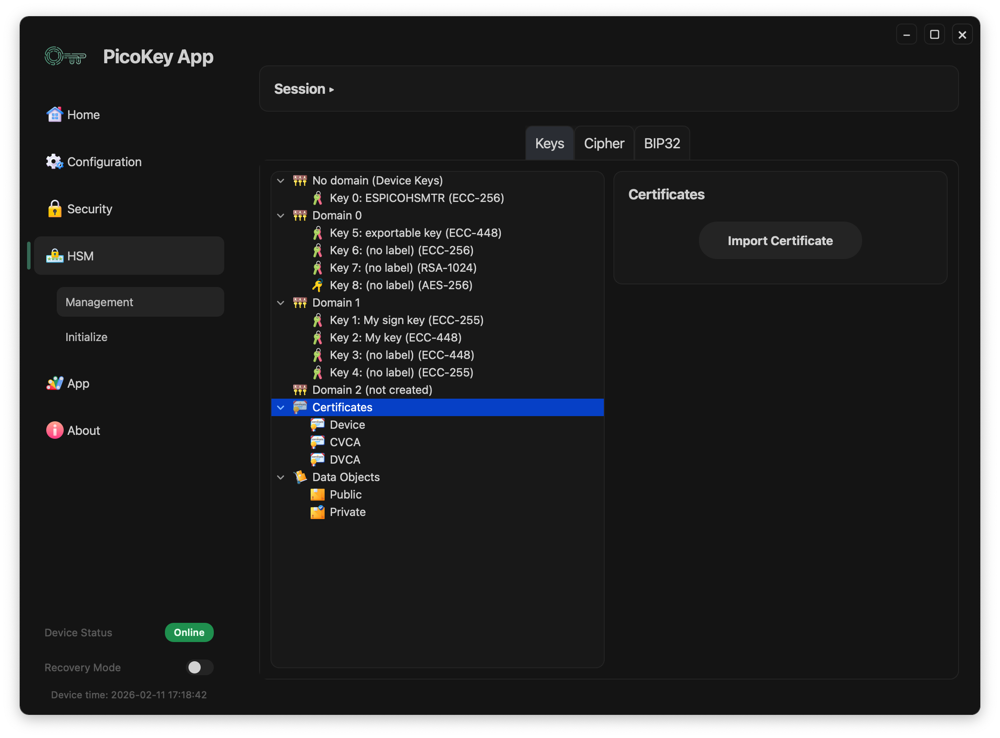

Action:

- **Import Certificate**: imports a certificate into the certificates store shown in the tree.

---

## Data objects (Import Object)

Selecting `Data Objects > Public` shows import actions for public data objects.

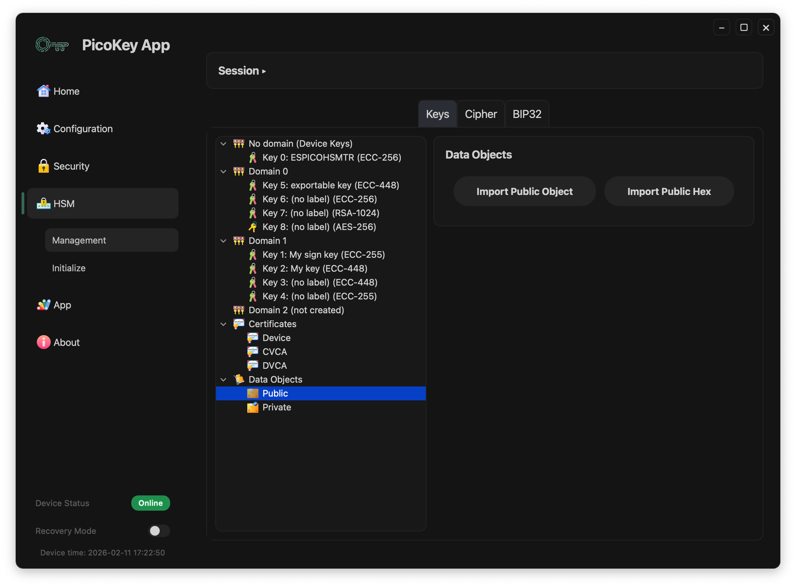

Available actions:

- **Import Public Object**: imports a public data object from a file.
- **Import Public Hex**: imports a public data object from hexadecimal input.

`Data Objects > Private` is reserved for private objects and follows the same tree navigation pattern.
