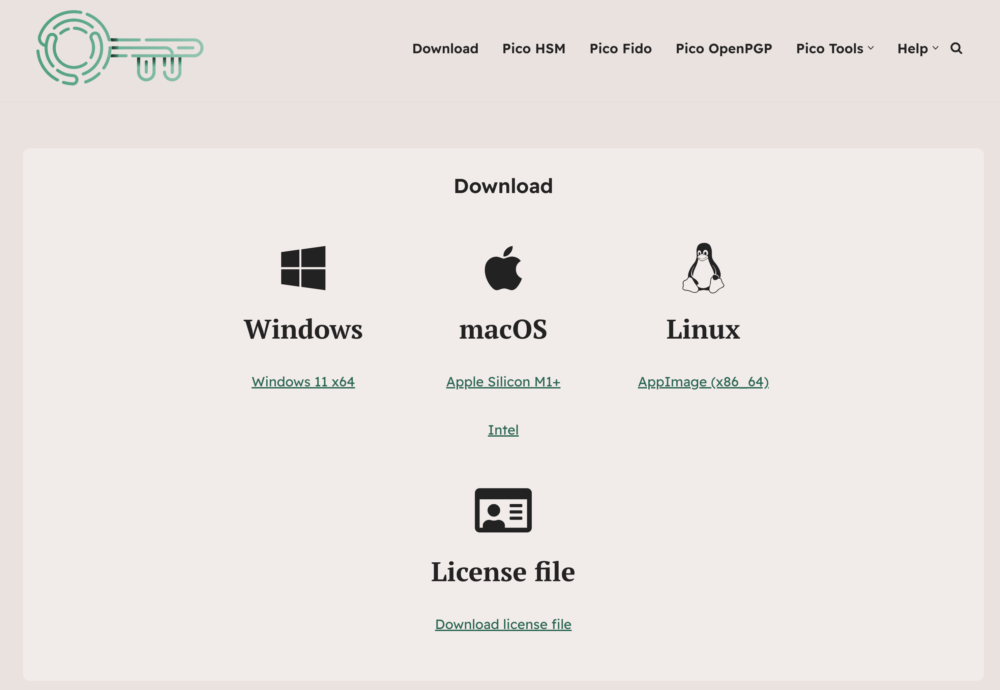

# Installation

This page explains how to install PicoKey App on your operating system.

## Downloads
Download PicoKey App from the official downloads page:

- PicoKey App downloads: [https://www.picokeys.com/picokeyapp/](https://www.picokeys.com/picokeyapp/)

To proceed with the download, a license must be purchased first. Once the purchase is completed, a download link will be sent to your email, granting access to the Downloads page. From there, you can download the application for Windows, Linux, and macOS, along with the corresponding license file.



!!! note
    Always download PicoKey App from official sources to avoid tampered binaries.

## Windows
1. Download the `.exe` portable build.
2. No installer is required. Just put the app in the desired folder.
3. Launch **PicoKey App** from the Start menu.

### Windows driver notes
PicoKey App uses standard USB drivers where possible. If your device is not detected, go to:

- [Troubleshooting](troubleshooting.md)

## macOS
1. Download the `.dmg` (or `.zip`) build.
2. Drag **PicoKey App** into **Applications**.
3. Open PicoKey App.

!!! tip
    If macOS blocks the app, open **System Settings → Privacy & Security** and allow the application.

## Linux
1. Download the AppImage.
2. Make it executable:
   ```bash
   chmod +x PicoKeyApp.AppImage
   ```
3. Run it:
    ```bash
    ./PicoKeyApp.AppImage
    ```

!!! tip
Linux permissions (USB access)
If the device is not detected, you may need udev rules or group permissions. See:

- [Troubleshooting](troubleshooting.md)

Once finished with all steps and ensuring the app is working properly, go to [First Steps](first-steps.md).
