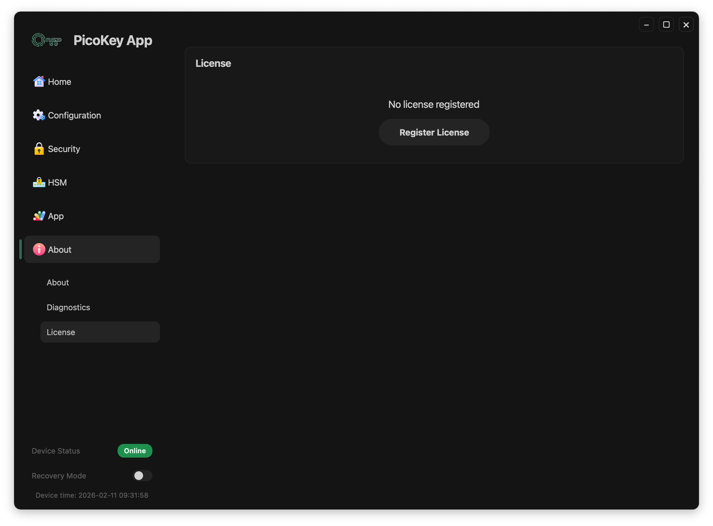
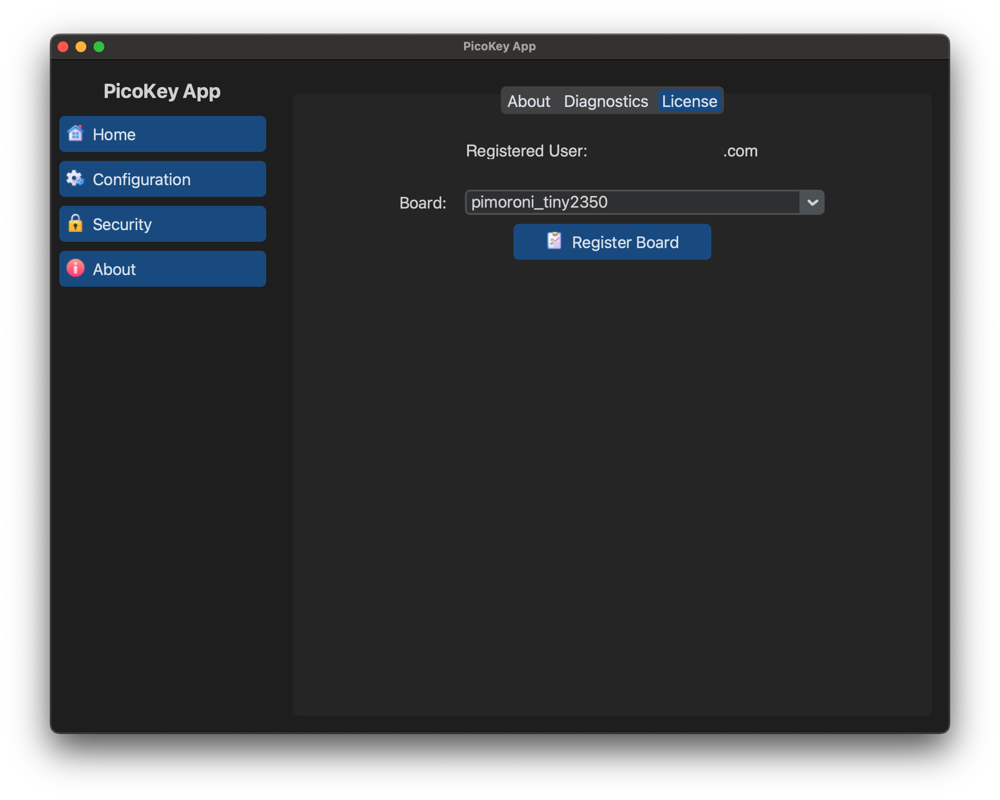

# License and registration

The **License** section manages application and device licensing.

---

## Unregistered state

When no license is present:

- The status shows *Not registered*
- The **Register License** button is available

---

## Registered state

When a license is present:

- The registered user is displayed
- The target board can be selected
- The **Register Board** button binds the license to the device

!!! Note
    The number of boards that can be registered depends on the number of the
    purchased licenses. Each license has a number of seats that can be increased
    by purchasing more licenses with the same email address.

