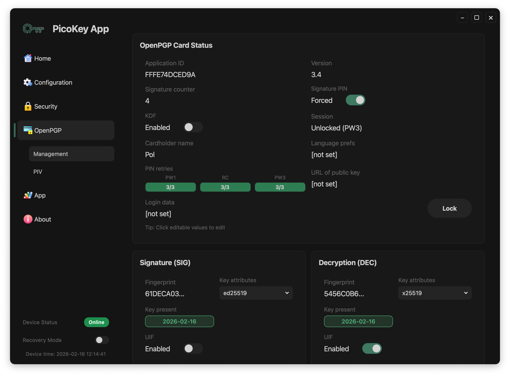
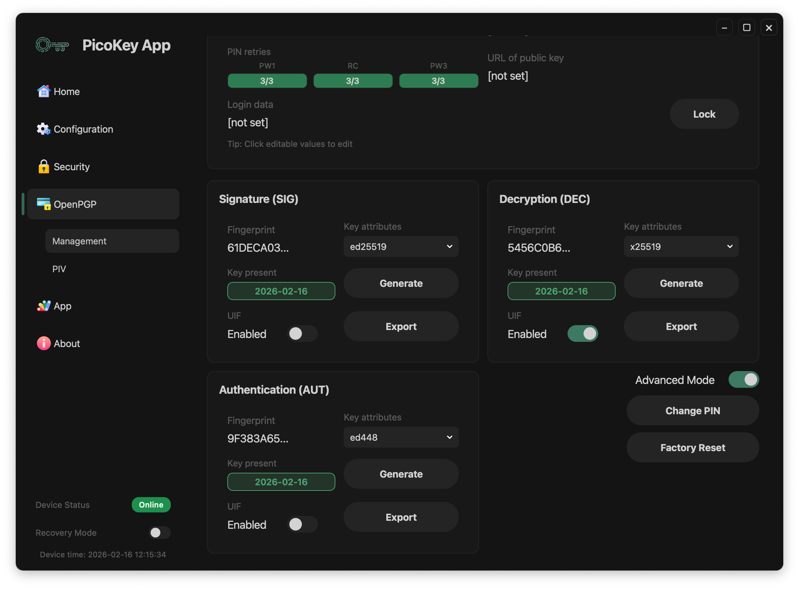
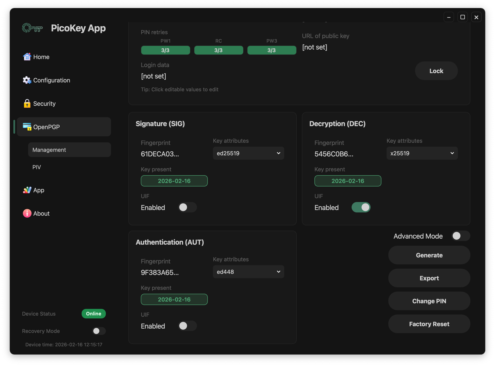

# OpenPGP Management

This page documents the **OpenPGP > Management** view in PicoKey App.

---

## Overview

The OpenPGP management view is organized into:

- **OpenPGP Card Status** (card metadata and PIN/session state)
- **Operation modes**:
  - `Basic` (global key operations)
  - `Advanced` (slot-level key operations)
- **Key slots**:
  - Signature (`SIG`)
  - Decryption (`DEC`)
  - Authentication (`AUT`)
- **Maintenance actions**:
  - `Lock`
  - `Change PIN`
  - `Factory Reset`

---

## Access model (PW1 / PW3)

OpenPGP management can be unlocked with:

- `PW1` (user context)
- `PW3` (admin context)

Admin-level operations require `PW3` unlock. This includes key generation/export workflows and editing protected card settings.

When only `PW1` is unlocked, the panel remains readable but admin-write actions stay restricted.

---

## Card status

The **OpenPGP Card Status** section shows:

- `Application ID`
- `Version`
- `Signature counter`
- `Signature PIN` mode (toggle)
- `KDF` state
- `Session` state (for example `Unlocked (PW3)`)
- `Cardholder name`
- `Language prefs`
- `URL of public key`
- `Login data`
- `PIN retries` for `PW1`, `RC`, and `PW3`

The panel also displays this hint:

- `Tip: Click editable values to edit`

!!! note
    Fields and editability depend on firmware capabilities and the current authentication state.

---

## Operation modes

OpenPGP management provides two operation modes:

### Basic mode

In **Basic** mode, key operations are global for the OpenPGP keyset:

- **Generate** creates/regenerates key material for all three slots (`SIG`, `DEC`, `AUT`).
- **Export** exports public keys for all three slots in one global operation.

### Advanced mode

In **Advanced** mode, operations are granular per slot:

- **Generate** is available independently for each slot (`SIG`, `DEC`, `AUT`).
- **Export** can be executed for a single slot, exporting only that slot's public key.

!!! warning
    Generating a key always replaces existing key material in the target scope (all slots in `Basic`, one slot in `Advanced`).

---

## Key slots (SIG / DEC / AUT)

Each slot panel exposes:

- **Fingerprint** (or `[none]` when empty)
- **Key attributes** selector (algorithm/key type)
- **Key present** state/date (or `Empty`)
- **Generate** button (in `Advanced` mode)
- **Export** action (in `Advanced` mode)
- **UIF** toggle (user interaction control)

Typical state examples:

- `SIG` is populated (`ed25519`)
- `DEC` is populated (`x25519`)
- `AUT` is empty and set to `RSA 2048`

## Public key export format

When exporting OpenPGP public keys, PicoKey App saves them in:

- `.asc` format
- ASCII armored representation

!!! note
    This is the standard armored OpenPGP public key format used by most OpenPGP tools, both for global export (`Basic`) and per-slot export (`Advanced`).

---

## Session and maintenance actions

### Lock

- **Lock** closes the current OpenPGP management session.
- Sensitive actions may require re-authentication afterwards.

### Change PIN

- **Change PIN** opens the PIN update workflow.
- Use it to rotate user/admin credentials according to your policy.

### Factory reset

- **Factory Reset** wipes OpenPGP card data and keys (admin/destructive operation).

!!! danger
    Factory reset is destructive and cannot be undone.

---

## Registration requirement

This panel requires a registered board in PicoKey App. If the board is not registered, controls are restricted.
