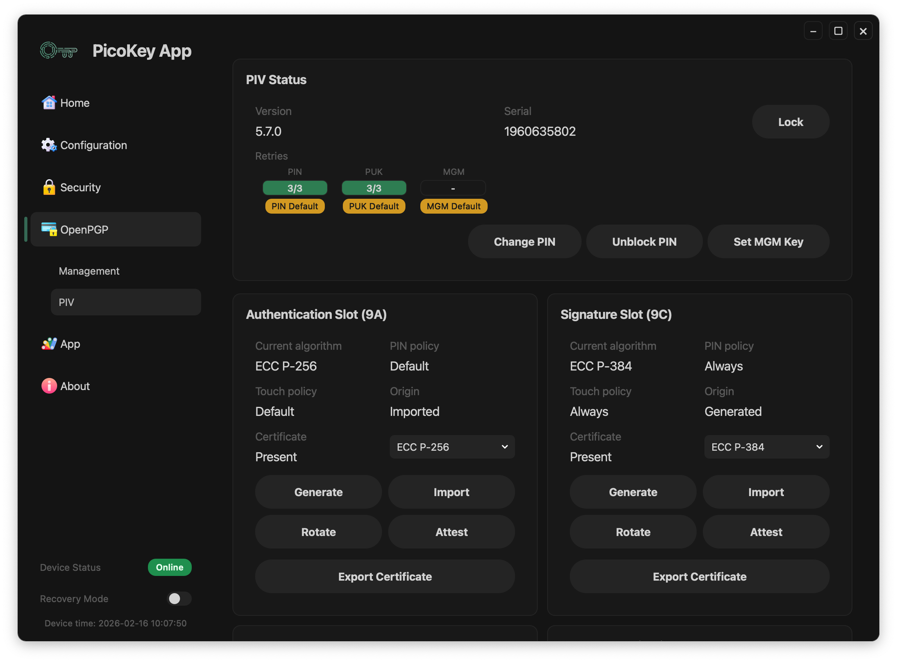
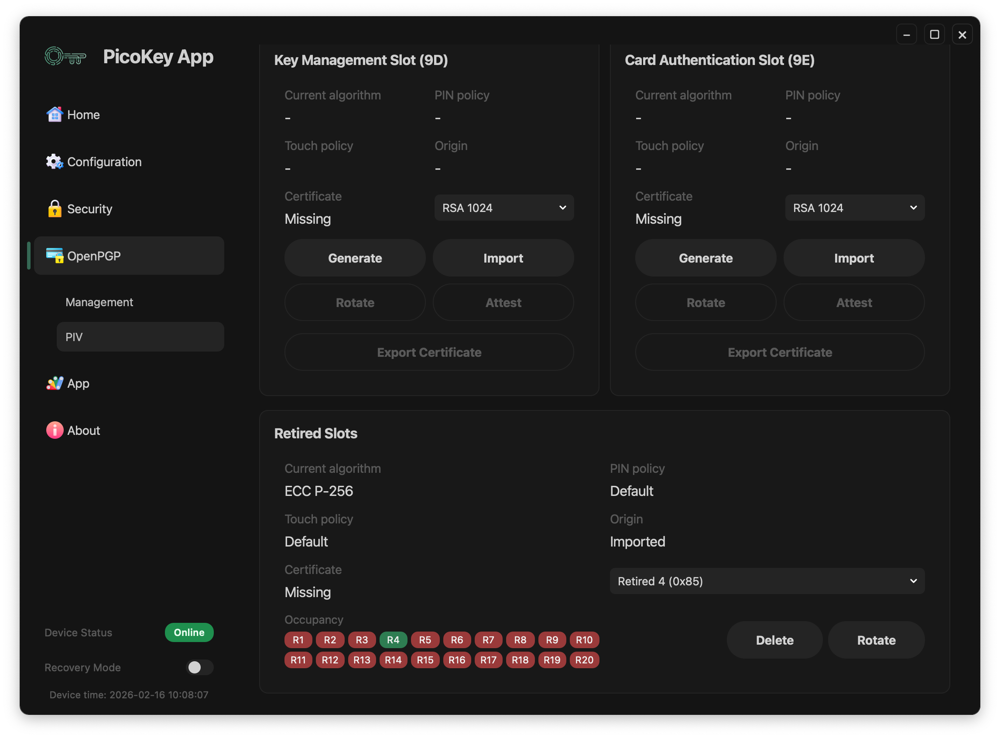
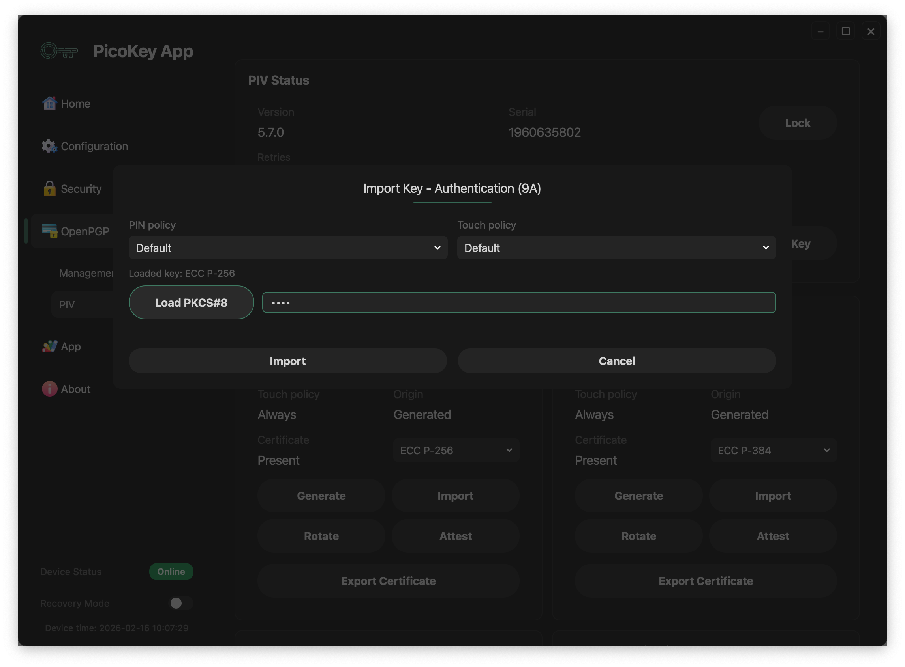
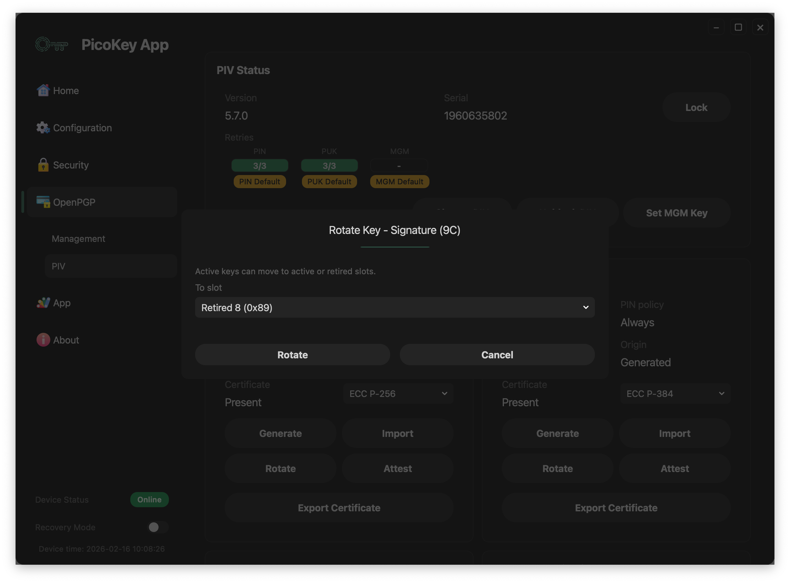

# PIV

This page documents the **OpenPGP > PIV** view in PicoKey App.

---

## PIV status

The **PIV Status** panel includes:

- `Version`
- `Serial`
- Retry counters for:
  - `PIN`
  - `PUK`
  - `MGM`
- Default credential indicators (`PIN Default`, `PUK Default`, `MGM Default`)
- Session action: `Unlock` / `Lock` (toggle)
- Credential actions:
  - `Change PIN`
  - `Unblock PIN`
  - `Set MGM Key`

PIV unlock is performed using the **MGM key** (management key), not the user PIN.

!!! warning
    Default PIN/PUK/MGM values should be changed before production use.

---

## Slot model

The view shows standard PIV slot groups:

- **Authentication Slot (9A)**
- **Signature Slot (9C)**
- **Key Management Slot (9D)**
- **Card Authentication Slot (9E)**
- **Retired Slots**

Per-slot metadata shown in the UI:

- `Current algorithm`
- `PIN policy`
- `Touch policy`
- `Origin` (for example `Generated` or `Imported`)
- Certificate state (`Present` or `Missing`)

Typical slot actions:

- `Generate`
- `Import`
- `Rotate` (enabled only when applicable)
- `Attest` (enabled only when applicable)
- `Export Certificate` (enabled when a certificate is present)

!!! note
    Disabled buttons indicate operations not available for the current slot state.

---

## Import key workflow

The import modal (`Import Key - Authentication (9A)`) is used to load an existing private key into a PIV slot.

### Fields and controls

- `PIN policy`: defines when PIN verification is required for key usage.
- `Touch policy`: defines whether user presence/touch is required.
- `Load PKCS#8`: opens the file picker to load a PKCS#8 private key.
- `Loaded key`: read-only indicator with the parsed key type (example shown: `ECC P-256`).
- Passphrase input: unlocks the key when the PKCS#8 file is encrypted.
- `Import`: confirms and writes the key to the selected slot.
- `Cancel`: closes the modal without changes.

### Recommended flow

1. Open the target slot and click **Import**.
2. Set `PIN policy` and `Touch policy` according to your security requirements.
3. Click **Load PKCS#8** and select the key file.
4. Verify the `Loaded key` type is the expected one for that slot.
5. If needed, enter the key passphrase.
6. Click **Import** to apply the operation.

### Result

- On success, the slot origin becomes `Imported`.
- Slot metadata and certificate actions are refreshed based on the new key state.

!!! tip
    Ensure the imported key matches the selected slot algorithm and certificate policy.

---

## Rotate key workflow

The rotate modal (`Rotate Key - Signature (9C)`) moves an active key to another slot.

### Fields and controls

- `To slot`: destination selector (active slot, retired slot, or `Delete permanently`).
- `Rotate`: executes the move.
- `Cancel`: closes the modal without changes.

Active keys can be moved to active or retired slots.

### Recommended flow

1. In the source slot, click **Rotate**.
2. Select the destination in `To slot`.
3. Confirm with **Rotate**.

### Result

- The key is reassigned to the selected destination slot.
- Occupancy indicators in **Retired Slots** are updated when rotating keys into retired positions.
- Disabled rotate actions in some slots indicate there is no key material available to move.
- Keys moved to **Retired Slots** cannot be moved back to active slots.
- Choosing `Delete permanently` removes key material irreversibly.

---

## Retired slots

The **Retired Slots** panel includes:

- Slot selector (example: `Retired 4 (0x85)`)
- Occupancy indicator for retired slots (`R1` to `R20`)
- Actions:
  - `Delete`
  - `Rotate`

Retired slots are archival positions used to store keys and certificates that are no longer active (for example, expired material kept for traceability).

Occupied retired slots are shown in green and empty ones in red.

!!! danger
    Material moved to retired slots cannot be returned to active slots. Deleting or rotating retired slot material can permanently impact certificate history and recovery workflows.

---

## Registration requirement

This panel requires a registered board in PicoKey App. If the board is not registered, controls are restricted.
