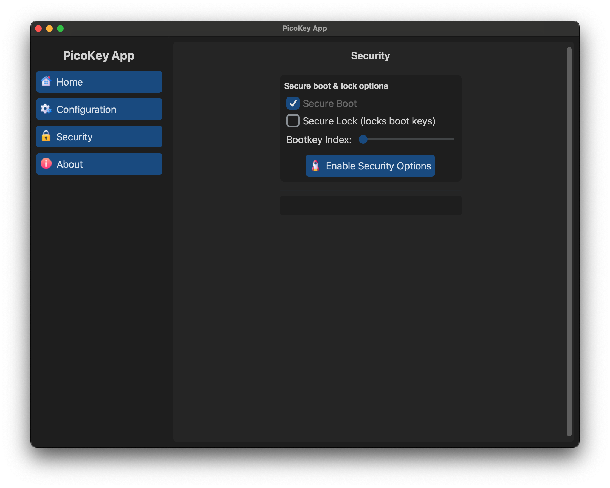

# Security initialization

This page describes the **security initialization and provisioning options** available with PicoKeyApp.

These options are **applied once during initialization** and directly affect the security model of the authenticator.

## Secure boot and lock options

### Secure Boot

When enabled:

- Firmware authenticity is verified at boot
- Only signed firmware images are allowed

!!! note
    Secure Boot is strongly recommended for production devices.

---

### Secure Lock

Locks the boot keys permanently.

- Prevents boot key replacement
- Protects against firmware downgrade attacks

!!! danger
    Secure Lock is irreversible. Enabling it incorrectly may permanently brick the device.
