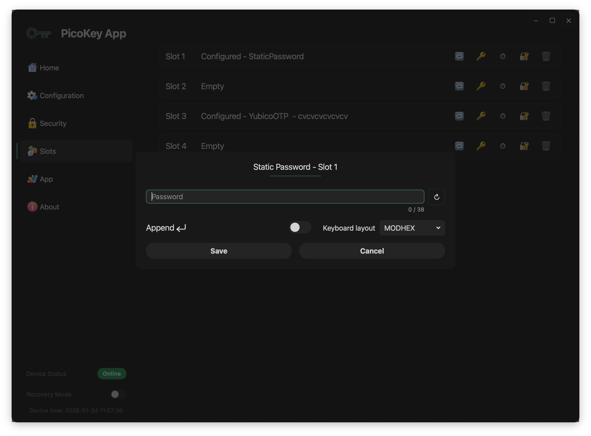

# Slot: Static Password

This page describes the **Static Password slot type** available in PicoKeyApp.

The Static Password slot stores a fixed password that is emitted by the device as **keyboard input** when triggered.

---

## Overview

The Static Password slot allows the device to:

- Store a static password securely
- Emit the password as keystrokes
- Behave as a USB keyboard when activated

This mechanism is compatible with systems that accept keyboard input.

---

## Activation mechanism

The Static Password slot is activated through the **OTP / button interface**.

Activation works as follows:

- The user presses the BOOTSEL button **N times**
- `N` corresponds to the slot number
- Once activated, the device types the stored password
- The password is sent as if typed on a physical keyboard

!!! note
    No software on the host is required beyond standard USB HID keyboard support.

---

## Slot configuration

### Password

Defines the static password stored in the slot.

- The password is stored securely on the device
- The password cannot be retrieved once stored
- The maximum length is limited by the slot implementation

!!! warning
    Losing the password means it cannot be recovered from the device.

---

### Append Enter

When enabled:

- A newline (Enter key) is sent after the password
- Useful for automatic form submission

!!! tip
    Enable this option when logging into terminals or login forms.

---

### Keyboard layout

Defines how characters are translated into keyboard scancodes.

- Different layouts affect how characters are typed
- The selected layout must match the host system keyboard layout

!!! warning
    A mismatched keyboard layout may produce incorrect characters.

---

## Save and cancel

- **Save** stores the password permanently in the slot
- **Cancel** discards the configuration

!!! danger
    Saving overwrites any existing slot configuration.

---

## Security considerations

The Static Password slot:

- Does not expose the password over software interfaces
- Emits the password only as keyboard input
- Can be triggered without host authentication

!!! warning
    Anyone with physical access to the device may trigger the slot.

---

## Typical use cases

Common use cases include:

- Login to systems without password managers
- Unlocking encrypted volumes
- Entering recovery passwords
- Automating repetitive authentication steps

!!! tip
    Use Static Password slots only on trusted systems.

---

## Limitations

- No challenge-response
- No host-side verification
- Password is static
- Susceptible to shoulder surfing or screen recording

!!! note
    This slot prioritizes convenience over cryptographic authentication.

